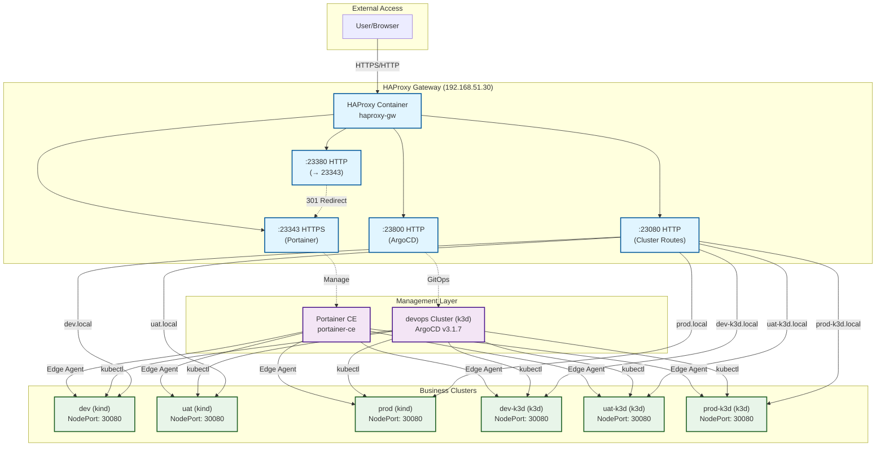
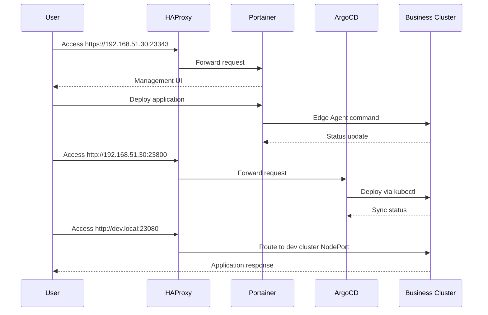

# Kindler

> A lightweight local development environment orchestrator powered by Portainer CE, HAProxy, and Kubernetes (kind/k3d)

**Kindler** provides a simple, fast, and efficient way to manage containerized applications and lightweight Kubernetes clusters through a unified gateway and management interface.

[中文文档](./README_CN.md) | [English](./README.md)

## Features

- 🚀 **Unified Gateway**: Single entry point via HAProxy for all services
- 🎯 **Centralized Management**: Manage containers and clusters through Portainer CE
- 🔄 **GitOps Ready**: Built-in ArgoCD for declarative application deployment
- 🌐 **Domain-based Routing**: Automatic HAProxy configuration for environment access
- 🛠️ **Flexible Backends**: Support both kind and k3d Kubernetes distributions
- 📦 **Automated Registration**: Auto-register clusters to Portainer and ArgoCD
- 🔒 **Production-ready**: TLS support with automatic redirects

## Architecture



### Architecture Overview



## Quick Start

### Prerequisites

- Docker Engine (20.10+)
- Docker Compose (v2.0+)
- kubectl (for k8s cluster management)
- One of: kind (v0.20+) or k3d (v5.6+)

### Installation

1. **Clone the repository**
   ```bash
   git clone https://github.com/hofmannhe/kindler.git
   cd kindler
   ```

2. **Configure secrets**
   ```bash
   # Set Portainer admin password (default: admin123)
   echo 'PORTAINER_ADMIN_PASSWORD=your-secure-password' > config/secrets.env

   # Configure HAProxy host (default: 192.168.51.30)
   echo 'HAPROXY_HOST=192.168.51.30' >> config/clusters.env
   ```

3. **Bootstrap infrastructure**
   ```bash
   ./scripts/bootstrap.sh
   ```
   This will:
   - Start Portainer CE container
   - Start HAProxy gateway
   - Create `devops` k3d cluster
   - Deploy ArgoCD v3.1.7

4. **Access management interfaces**
   - Portainer: `https://192.168.51.30:23343` (self-signed cert)
   - ArgoCD: `http://192.168.51.30:23800`
     - Username: `admin`
     - Password: See `config/secrets.env` (`ARGOCD_ADMIN_PASSWORD`)

### Create Business Clusters

Create clusters defined in `config/environments.csv`:

```bash
# Create a single environment
./scripts/create_env.sh -n dev -p kind

# Create all environments from CSV
for env in dev uat prod dev-k3d uat-k3d prod-k3d; do
  ./scripts/create_env.sh -n $env
done
```

The script will automatically:
- ✅ Create the Kubernetes cluster (kind/k3d)
- ✅ Register to Portainer via Edge Agent
- ✅ Register to ArgoCD with kubectl context
- ✅ Configure HAProxy domain routing

### Access Your Clusters

- **Portainer**: `https://192.168.51.30:23343`
- **ArgoCD**: `http://192.168.51.30:23800`
- **Business Apps** (via domain routing):
  ```bash
  curl -H 'Host: dev.local' http://192.168.51.30:23080
  curl -H 'Host: uat.local' http://192.168.51.30:23080
  curl -H 'Host: prod.local' http://192.168.51.30:23080
  ```

## Project Structure

```
kindler/
├── clusters/           # k3d/kind cluster configurations
├── compose/            # Docker Compose files
│   ├── haproxy/       # HAProxy gateway setup
│   └── portainer/     # Portainer CE setup
├── config/            # Configuration files
│   ├── environments.csv    # Environment definitions
│   ├── clusters.env        # Cluster image versions
│   └── secrets.env         # Passwords and tokens
├── scripts/           # Management scripts
│   ├── bootstrap.sh        # Initialize infrastructure
│   ├── create_env.sh       # Create business cluster
│   ├── delete_env.sh       # Delete cluster
│   ├── clean.sh            # Clean all resources
│   └── haproxy_sync.sh     # Sync HAProxy routes
├── manifests/         # Kubernetes manifests
│   └── argocd/        # ArgoCD installation
└── tests/             # Test scripts
```

## Configuration

### Environment Definition (CSV)

Edit `config/environments.csv` to define your environments:

```csv
# env,provider,node_port,pf_port,register_portainer,haproxy_route,http_port,https_port
dev,kind,30080,19001,true,true,18090,18443
uat,kind,30080,29001,true,true,28080,28443
prod,kind,30080,39001,true,true,38080,38443
dev-k3d,k3d,30080,19002,true,true,18091,18444
```

**Columns:**
- `env`: Environment name (unique identifier)
- `provider`: `kind` or `k3d`
- `node_port`: Cluster NodePort for Traefik (default: 30080)
- `pf_port`: Port-forward local port (for debugging)
- `register_portainer`: Auto-register to Portainer (`true`/`false`)
- `haproxy_route`: Add HAProxy domain route (`true`/`false`)
- `http_port`: Cluster HTTP port mapping
- `https_port`: Cluster HTTPS port mapping

### Cluster Images

Configure Kubernetes versions in `config/clusters.env`:

```bash
KIND_NODE_IMAGE=kindest/node:v1.31.12
K3D_IMAGE=rancher/k3s:stable
```

## Management Commands

### Cluster Lifecycle

```bash
# Create cluster (use CSV defaults)
./scripts/create_env.sh -n dev

# Create cluster (override options)
./scripts/create_env.sh -n dev -p kind --node-port 30081 --no-register-portainer

# Delete specific cluster
./scripts/delete_env.sh -n dev -p kind

# Clean all resources (clusters, containers, networks, volumes)
./scripts/clean.sh
```

### HAProxy Route Management

```bash
# Sync routes from CSV
./scripts/haproxy_sync.sh

# Sync and prune unlisted routes
./scripts/haproxy_sync.sh --prune
```

### Portainer Management

```bash
# Start/update Portainer
./scripts/portainer.sh up

# Manually add endpoint
./scripts/portainer.sh add-endpoint myenv https://cluster-ip:9001
```

## Port Reference

| Service | Port | Protocol | Purpose |
|---------|------|----------|---------|
| Portainer HTTP | 23380 | HTTP | Redirects to 23343 |
| Portainer HTTPS | 23343 | HTTPS | Management UI |
| ArgoCD | 23800 | HTTP | GitOps interface |
| Cluster Routes | 23080 | HTTP | Domain-based routing |

## Verification

```bash
# Portainer HTTPS
curl -kI https://192.168.51.30:23343
# Expected: HTTP/1.1 200 OK

# Portainer HTTP (redirect)
curl -I http://192.168.51.30:23380
# Expected: HTTP/1.1 301 Moved Permanently

# ArgoCD
curl -I http://192.168.51.30:23800
# Expected: HTTP/1.1 200 OK

# Cluster route (with domain header)
curl -H 'Host: dev.local' -I http://192.168.51.30:23080
# Expected: HTTP/1.1 200 OK (or backend service response)
```

## Advanced Usage

### Custom Domain Routing

By default, clusters are accessible via `<env>.local`. To use custom domains:

1. Update `BASE_DOMAIN` in `config/clusters.env`:
   ```bash
   BASE_DOMAIN=k8s.example.com
   ```

2. Re-sync HAProxy routes:
   ```bash
   ./scripts/haproxy_sync.sh --prune
   ```

3. Access via custom domain:
   ```bash
   curl -H 'Host: dev.k8s.example.com' http://192.168.51.30:23080
   ```

### Multi-Node Clusters

Edit cluster config files in `clusters/` to add worker nodes:

```yaml
# clusters/dev-cluster.yaml (kind)
kind: Cluster
apiVersion: kind.x-k8s.io/v1alpha4
nodes:
  - role: control-plane
  - role: worker
  - role: worker
```

```yaml
# clusters/dev-k3d-cluster.yaml (k3d)
apiVersion: k3d.io/v1alpha5
kind: Simple
servers: 1
agents: 2
```

## Testing

Run smoke tests for a cluster:

```bash
./scripts/smoke.sh dev
```

Test results are logged to `docs/TEST_REPORT.md`.

## Troubleshooting

### Portainer Edge Agent Not Connecting

1. Check Edge Agent logs:
   ```bash
   kubectl logs -n portainer deploy/portainer-agent
   ```

2. Verify network connectivity:
   ```bash
   docker network inspect k3d-dev
   ```

3. Ensure HAProxy can reach cluster containers:
   ```bash
   docker network connect k3d-dev haproxy-gw
   ```

### HAProxy Route Not Working

1. Check HAProxy configuration:
   ```bash
   docker exec haproxy-gw cat /usr/local/etc/haproxy/haproxy.cfg
   ```

2. Verify backend health:
   ```bash
   curl -I http://192.168.51.30:23080/haproxy/stats
   ```

3. Re-sync routes:
   ```bash
   ./scripts/haproxy_sync.sh --prune
   ```

## Contributing

Contributions are welcome! Please:

1. Fork the repository
2. Create a feature branch (`git checkout -b feature/amazing-feature`)
3. Commit your changes (`git commit -m 'feat: add amazing feature'`)
4. Push to the branch (`git push origin feature/amazing-feature`)
5. Open a Pull Request

See [AGENTS.md](./AGENTS.md) for detailed development guidelines.

## License

This project is licensed under the Apache License 2.0 - see the [LICENSE](LICENSE) file for details.

## Acknowledgments

- [Portainer CE](https://www.portainer.io/) - Container management platform
- [HAProxy](http://www.haproxy.org/) - High-performance load balancer
- [kind](https://kind.sigs.k8s.io/) - Kubernetes in Docker
- [k3d](https://k3d.io/) - k3s in Docker
- [ArgoCD](https://argo-cd.readthedocs.io/) - GitOps continuous delivery

## Support

- 📚 Documentation: [docs/](./docs/)
- 🐛 Issues: [GitHub Issues](https://github.com/hofmannhe/kindler/issues)
- 💬 Discussions: [GitHub Discussions](https://github.com/hofmannhe/kindler/discussions)
