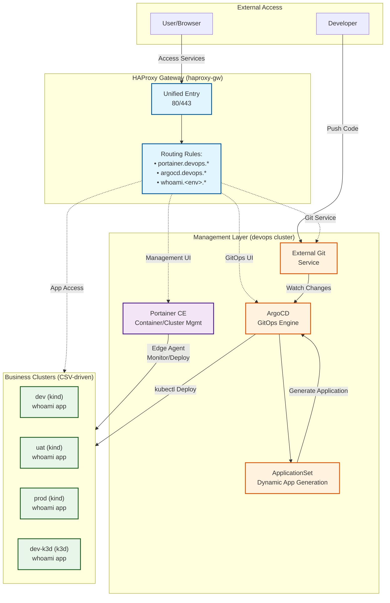
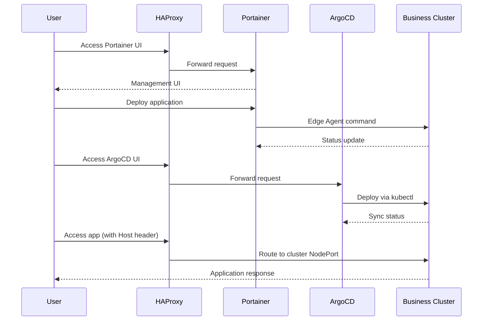

# Kindler

> A lightweight local development environment orchestrator powered by Portainer CE, HAProxy, and Kubernetes (kind/k3d)

**Kindler** provides a simple, fast, and efficient way to manage containerized applications and lightweight Kubernetes clusters through a unified gateway and management interface.

[中文文档](./README_CN.md) | [English](./README.md)

## Features

- 🚀 **Unified Gateway**: Single entry point via HAProxy for all services
- 🎯 **Centralized Management**: Manage containers and clusters through Portainer CE
- 🔄 **GitOps Ready**: Built-in ArgoCD for declarative application deployment
- 🌐 **Domain-based Routing**: Automatic HAProxy configuration for environment access
- 🛠️ **Flexible Backends**: Support both kind and k3d Kubernetes distributions
- 📦 **Automated Registration**: Auto-register clusters to Portainer and ArgoCD
- 🔒 **Production-ready**: TLS support with automatic redirects
- 🔄 **Unified Ingress (NodePort)**: Always route via NodePort for both kind and k3d, so apps don’t care about the distro

## Architecture

### System Topology



> **Description**:
> - **HAProxy**: Unified gateway for domain-based routing
> - **devops cluster**: Runs infrastructure services (Portainer, ArgoCD)
> - **Business clusters**: Defined in `config/environments.csv`, auto-registered to Portainer and ArgoCD
> - **GitOps flow**: Code push → External Git service → ArgoCD watches → ApplicationSet generates → Auto-deploy

### Request Flow



## Quick Start

> Must-do Trilogy (after rollback/reinstall)
> 1) `./scripts/haproxy_sync.sh --prune`
> 2) `./scripts/setup_devops.sh`
> 3) `./scripts/sync_applicationset.sh`


### Prerequisites

- Docker Engine (20.10+)
- Docker Compose (v2.0+)
- kubectl (for k8s cluster management)
- One of: kind (v0.20+) or k3d (v5.6+)

### Installation

1. **Clone the repository**
   ```bash
   git clone https://github.com/hofmannhe/kindler.git
   cd kindler
   ```

2. **Configure environment** (optional, defaults are provided)
   ```bash
   # Edit configuration files as needed
   cp config/git.env.example config/git.env  # External Git settings (keep local only)
   nano config/git.env          # Fill Git repository URL & credentials
   nano config/clusters.env    # HAProxy host, base domain, versions
   nano config/secrets.env     # Admin passwords
   nano config/environments.csv # Cluster definitions
   ```

3. **Bootstrap infrastructure**
   ```bash
   ./scripts/bootstrap.sh
   ```
   This will:
   - Start Portainer CE container
   - Start HAProxy gateway
   - Create `devops` management cluster
   - Deploy ArgoCD

4. **Create everything (3 kind + 3 k3d) with timing and health checks**
   ```bash
   # Optional full clean first
   # Use --all to guarantee Portainer admin reset (removes portainer_data/portainer_secrets volumes)
   ./scripts/clean.sh --all

   # One-click bring-up (includes bootstrap)
   ./scripts/full_cycle.sh --concurrency 3
   ```

5. **Access management interfaces**
   - Portainer: `https://<HAPROXY_HOST>` (self-signed cert, defaults to `https://192.168.51.30`)
   - ArgoCD: `http://<HAPROXY_HOST>` (defaults to `http://192.168.51.30`)
     - Username: `admin`
     - Password: See `config/secrets.env`

### Create/Delete Business Clusters (manually)

Create clusters defined in `config/environments.csv`:

```bash
# Create a single environment (CSV-driven defaults)
./scripts/create_env.sh -n dev

# Create multiple environments (from CSV)
for env in dev uat prod dev-k3d uat-k3d prod-k3d; do ./scripts/create_env.sh -n "$env"; done

# Stop/Start
./scripts/stop_env.sh -n dev
./scripts/start_env.sh -n dev

# Permanently delete (also prunes CSV/Portainer/ArgoCD/HAProxy)
./scripts/delete_env.sh -n dev
```

The create script automatically:
- ✅ Create the Kubernetes cluster (kind/k3d based on CSV config)
- ✅ Register to Portainer via Edge Agent
- ✅ Register to ArgoCD with kubectl context
- ✅ Configure HAProxy domain routing (SQLite `clusters` as source; CSV only for bootstrap import)

### Access Your Clusters & Apps

Access points depend on your configuration in `config/clusters.env` and `config/environments.csv`:

- Management
  - Portainer: `https://portainer.devops.$BASE_DOMAIN` (e.g. https://portainer.devops.192.168.51.30.sslip.io)
    - Username: `admin`, Password: `config/secrets.env: PORTAINER_ADMIN_PASSWORD`
  - ArgoCD: `http://argocd.devops.$BASE_DOMAIN` (e.g. http://argocd.devops.192.168.51.30.sslip.io)
    - Username: `admin`, Password: `config/secrets.env: ARGOCD_ADMIN_PASSWORD`
  - HAProxy stats: `http://haproxy.devops.$BASE_DOMAIN/stat`

- whoami (via HAProxy Host-based routing, NodePort 30080)
  ```bash
  BASE=192.168.51.30
  # New naming convention: {service}.{cluster_type}.{env}.{base_domain}
  curl -I -H 'Host: whoami.kind.dev.192.168.51.30.sslip.io'  http://$BASE
  curl -I -H 'Host: whoami.kind.uat.192.168.51.30.sslip.io'  http://$BASE
  curl -I -H 'Host: whoami.kind.prod.192.168.51.30.sslip.io' http://$BASE
  curl -I -H 'Host: whoami.k3d.dev.192.168.51.30.sslip.io'  http://$BASE
  curl -I -H 'Host: whoami.k3d.uat.192.168.51.30.sslip.io'  http://$BASE
  curl -I -H 'Host: whoami.k3d.prod.192.168.51.30.sslip.io' http://$BASE
  ```

## GitOps Workflow

Kindler includes a complete GitOps workflow for automated code-to-deployment.

### Core Components
- **External Git service**: Hosts application repositories (configure via `config/git.env`)
- **ArgoCD**: GitOps engine monitoring Git changes and auto-deploying (Access: http://argocd.devops.192.168.51.30.sslip.io)
- **ApplicationSet**: Dynamically generates ArgoCD Applications, driven by `config/environments.csv`

### Branch to Environment Mapping

- Branch name equals environment name. ArgoCD syncs branch=<env> to cluster=<env>.
- Examples: `dev`, `uat`, `prod`, `dev-k3d`, `uat-k3d`, `prod-k3d`.

### Quick Experience

```bash
# 1. Ensure config/git.env points to your external repository

# 2. Push code to the environment branch (e.g. dev/uat/prod/...)
cd /path/to/your/app
git push origin develop

# 3. ArgoCD auto-detects and deploys to the matching environment
# 4. Monitor deployment progress in ArgoCD UI
open http://argocd.devops.192.168.51.30.sslip.io

# 5. Verify deployment
curl -I -H 'Host: whoami.dev.192.168.51.30.sslip.io' http://192.168.51.30
```

### whoami Demo Application

Copy the Helm chart under `examples/whoami` into your external repository to demonstrate the workflow:

- **Repository**: configurable via `config/git.env`
- **Branches**: env-named branches (dev/uat/prod/dev-k3d/uat-k3d/prod-k3d)
- **Type**: Helm Chart (deploy/ directory)
- **Config Differences**: Only domain differs, all other configs identical (minimal difference principle)

Note:
- The `devops` management cluster does not deploy whoami; only business clusters from `config/environments.csv` are targeted.
- Environments are CSV-driven. Do not hardcode names in manifests/scripts; use `scripts/sync_applicationset.sh` to regenerate.

**Access Examples**:
```bash
# View dev environment
curl http://whoami.dev.192.168.51.30.sslip.io

# View uat environment
curl http://whoami.uat.192.168.51.30.sslip.io

# View prod environment
curl http://whoami.prod.192.168.51.30.sslip.io
```

> 📖 **Detailed Documentation**: [Complete GitOps Workflow Guide](./docs/GITOPS_WORKFLOW.md)

## Project Structure

```
kindler/
├── clusters/           # k3d/kind cluster configurations
├── compose/            # Docker Compose files
│   ├── haproxy/       # HAProxy gateway setup
│   └── portainer/     # Portainer CE setup
├── config/            # Configuration files
│   ├── environments.csv    # Environment definitions
│   ├── clusters.env        # Cluster image versions
│   ├── git.env.example     # External Git config template (copy to git.env)
│   └── secrets.env         # Passwords and tokens
├── scripts/           # Management scripts
│   ├── bootstrap.sh        # Initialize infrastructure
│   ├── create_env.sh       # Create business cluster
│   ├── stop_env.sh         # Stop cluster (preserve config)
│   ├── start_env.sh        # Start stopped cluster
│   ├── delete_env.sh       # Permanently delete cluster (incl. CSV config)
│   ├── clean.sh            # Clean all resources
│   └── haproxy_sync.sh     # Sync HAProxy routes
├── manifests/         # Kubernetes manifests
│   └── argocd/        # ArgoCD installation
└── tests/             # Test scripts
```

## Configuration

### Environment Definition (CSV)

Edit `config/environments.csv` to define your environments:

```csv
# env,provider,node_port,pf_port,register_portainer,haproxy_route,http_port,https_port
dev,kind,30080,19001,true,true,18090,18443
uat,kind,30080,29001,true,true,28080,28443
prod,kind,30080,39001,true,true,38080,38443
dev-k3d,k3d,30080,19002,true,true,18091,18444
```

**Columns:**
- `env`: Environment name (unique identifier)
- `provider`: `kind` or `k3d`
- `node_port`: Cluster NodePort for Traefik (default: 30080)
- `pf_port`: Port-forward local port (for debugging)
- `register_portainer`: Auto-register to Portainer (`true`/`false`)
- `haproxy_route`: Add HAProxy domain route (`true`/`false`)
- `http_port`: Cluster HTTP port mapping
- `https_port`: Cluster HTTPS port mapping

### Cluster Images

Configure Kubernetes versions in `config/clusters.env`:

```bash
KIND_NODE_IMAGE=kindest/node:v1.31.12
K3D_IMAGE=rancher/k3s:v1.31.5-k3s1
```

### Port Configuration

Default ports are configured through HAProxy. Override via `HAPROXY_HTTP_PORT` / `HAPROXY_HTTPS_PORT` if required:

- Portainer HTTPS: exposed at HAProxy HTTPS port (default `443`)
- Portainer HTTP: exposed at HAProxy HTTP port (default `80`, auto-redirects to HTTPS)
- ArgoCD: exposed at HAProxy HTTP port (`80` by default)
- Business applications: routed via HAProxy HTTP port with domain-based routing

### Domain Configuration

Set base domain in `config/clusters.env`:

```bash
BASE_DOMAIN=local  # Clusters will be accessible as <env>.local
HAPROXY_HOST=192.168.51.30  # Gateway entry point
```

**Service Domain Naming Convention:**

All services follow the pattern `<service>.<env>.$BASE_DOMAIN`:

- **Management Services** (devops environment):
  - Portainer: `portainer.devops.$BASE_DOMAIN` (e.g., `portainer.devops.192.168.51.30.sslip.io`)
  - ArgoCD: `argocd.devops.$BASE_DOMAIN`
  - HAProxy Stats: `haproxy.devops.$BASE_DOMAIN/stat`
  - Git Service: `git.devops.$BASE_DOMAIN`
  - **Web UI (Kindler)**: `kindler.devops.$BASE_DOMAIN` ⚠️ **Important: The Web UI uses "kindler" not "webui"**

- **Business Services** (cluster-specific):
  - Example whoami app: `whoami.<cluster-name>.$BASE_DOMAIN` (e.g., `whoami.dev.192.168.51.30.sslip.io`)
  - Full cluster name used (including provider suffix like `-k3d` or `-kind` if present)

## Management Commands

### Cluster Lifecycle

#### Create Environment
```bash
# Create cluster (use CSV defaults)
./scripts/create_env.sh -n dev

# Create cluster (override options)
./scripts/create_env.sh -n dev -p kind --node-port 30081 --no-register-portainer
```

#### Stop/Start Environment (Preserve Configuration)
```bash
# Stop cluster (preserve CSV config and kubeconfig, free resources)
./scripts/stop_env.sh -n dev

# Restart stopped cluster
./scripts/start_env.sh -n dev
```

> **Use Case**: Temporarily stop clusters to save resources, can quickly resume later. Ideal for dev environments not currently needed.

#### Permanently Delete Environment
```bash
# Permanently delete cluster (auto-cleanup CSV config, Portainer registration, ArgoCD registration, HAProxy routes)
./scripts/delete_env.sh -n dev
```

> **Warning**: This operation will:
> - Delete Kubernetes cluster
> - Remove configuration from `config/environments.csv`
> - Unregister Portainer Edge Environment
> - Unregister ArgoCD cluster
> - Remove HAProxy routes
> - Auto-sync ApplicationSet (remove related Applications)

#### Clean All Resources
```bash
# Clean all resources (clusters, containers, networks, volumes)
./scripts/clean.sh
```

### Operation Comparison

| Operation | Cluster Running | CSV Config | Portainer | ArgoCD | Purpose |
|-----------|----------------|------------|-----------|--------|---------|
| **stop_env.sh** | ❌ Stopped | ✅ Kept | ✅ Kept | ✅ Kept | Temporarily free resources |
| **start_env.sh** | ✅ Running | ✅ Used | ✅ Resume | ✅ Resume | Restart stopped cluster |
| **delete_env.sh** | ❌ Deleted | ❌ Deleted | ❌ Unregistered | ❌ Unregistered | Permanently remove environment |

### HAProxy Route Management

```bash
# Sync routes from CSV
./scripts/haproxy_sync.sh

# Sync and prune unlisted routes
./scripts/haproxy_sync.sh --prune
```

### Portainer Management

```bash
# Start/update Portainer
./scripts/portainer.sh up

# Manually add endpoint
./scripts/portainer.sh add-endpoint myenv https://cluster-ip:9001
```

## Port Reference

| Service | Default Port | Protocol | Purpose | Configurable |
|---------|--------------|----------|---------|--------------|
| Portainer HTTP | 23380 | HTTP | Redirects to HTTPS | Yes (haproxy.cfg) |
| Portainer HTTPS | 23343 | HTTPS | Management UI | Yes (haproxy.cfg) |
| ArgoCD | 23800 | HTTP | GitOps interface | Yes (haproxy.cfg) |
| Cluster Routes | 23080 | HTTP | Domain-based routing | Yes (haproxy.cfg) |

## Development Workflow (Git Worktrees)

- The repository root is reserved for the stable `master` (or `main`) branch to keep deployment artifacts clean and predictable.
- Use Git worktrees for feature development under a local, ignored directory `worktrees/` (not tracked by Git).

Quick usage
```bash
# 0) Prepare local directory (ignored by Git)
mkdir -p worktrees

# 1) Create and attach a worktree for a feature branch
git worktree add worktrees/feature-x feature/x

# 2) Develop inside the worktree
cd worktrees/feature-x
# ... edit/commit/push as usual ...

# 3) Remove worktree when done
cd -
git worktree remove worktrees/feature-x
git branch -D feature/x   # optional, if branch merged and no longer needed
```

Notes
- CI, scripts, and deployment flows must not depend on any files inside `worktrees/`.
- Root-level scripts and docs always target the stable `master/main`.

## User Configuration Guide

This project is designed to be portable across hosts. Below are common tasks when changing machines or network settings.

### Change Host IP / Gateway Domain

Option A — Use sslip.io (zero‑DNS)
- Edit `config/clusters.env`:
  - `HAPROXY_HOST=<new_host_ip>` (e.g. `192.168.88.10`)
  - `BASE_DOMAIN=<new_host_ip>.sslip.io` (e.g. `192.168.88.10.sslip.io`)

Option B — Local domain
- Edit `config/clusters.env`:
  - `HAPROXY_HOST=<new_host_ip>`
  - `BASE_DOMAIN=local`
- Update `/etc/hosts` (or LAN DNS): map `portainer.devops.local`, `argocd.devops.local`, and `whoami.<env>.local` to the new IP.

Option C — One‑click script
```bash
# Add a temporary alias to your default NIC and reconfigure to 192.168.51.35
# (ip alias requires root; omit --add-alias if not permitted)
sudo ./scripts/reconfigure_host.sh --host-ip 192.168.51.35 --sslip --add-alias
```

After editing `clusters.env`, refresh components
```bash
# 1) Refresh HAProxy routes
./scripts/haproxy_sync.sh --prune

# 2) Update devops ArgoCD Ingress
./scripts/setup_devops.sh

# 3) Regenerate ApplicationSet for business clusters
./scripts/sync_applicationset.sh

# 4) Verify (example for sslip.io)
BASE=<new_host_ip>
curl -I -H "Host: portainer.devops.$BASE.sslip.io" http://$BASE   # 301
curl -I -H "Host: argocd.devops.$BASE.sslip.io"  http://$BASE     # 200/302
curl -I -H "Host: whoami.dev.$BASE.sslip.io"     http://$BASE     # 200
```

Notes
- Clusters do not need recreation for IP/domain changes; HAProxy and Ingress hosts derive from `BASE_DOMAIN`.
- If external ports change, set `HAPROXY_HTTP_PORT`/`HAPROXY_HTTPS_PORT` and restart compose:
  ```bash
  docker compose -f compose/infrastructure/docker-compose.yml down && \
  docker compose -f compose/infrastructure/docker-compose.yml up -d
  ```

Full re-initialize (optional)
```bash
./scripts/clean.sh
./scripts/full_cycle.sh --concurrency 3
```

> **Note**: All ports can be customized by editing `compose/infrastructure/haproxy.cfg` and restarting HAProxy.

## Verification

Default configuration verification (adjust for your settings):

```bash
# Replace with your HAPROXY_HOST from config/clusters.env
HAPROXY_HOST=192.168.51.30

# Portainer HTTPS
curl -kI https://${HAPROXY_HOST}
# Expected: HTTP/1.1 200 OK

# Portainer HTTP (redirect)
curl -I http://${HAPROXY_HOST}
# Expected: HTTP/1.1 301 Moved Permanently

# ArgoCD
curl -I http://${HAPROXY_HOST}
# Expected: HTTP/1.1 200 OK

# Cluster route (with domain header, adjust BASE_DOMAIN as needed)
curl -H 'Host: dev.local' -I http://${HAPROXY_HOST}
# Expected: HTTP/1.1 200 OK (or backend service response)
```

## Advanced Usage

### Domain Name Resolution

Kindler supports three DNS resolution strategies:

#### Option 1: sslip.io (Zero Configuration, Recommended) ✅

Uses public DNS service that automatically resolves to your IP:

```bash
# config/clusters.env (default)
BASE_DOMAIN=192.168.51.30.sslip.io
HAPROXY_HOST=192.168.51.30

# Access services directly
curl http://whoami.dev.192.168.51.30.sslip.io
curl http://whoami.uat.192.168.51.30.sslip.io
```

**Pros:**
- Zero configuration required
- Works immediately after installation
- Perfect for multi-user environments
- No local DNS setup needed

**Cons:**
- Longer domain names
- Requires internet connectivity for DNS resolution

#### Option 2: Local /etc/hosts (Clean Domains)

Manage local DNS entries with the provided script:

```bash
# Change BASE_DOMAIN to local domain
nano config/clusters.env
# Set: BASE_DOMAIN=local

# Sync all environments to /etc/hosts
sudo ./scripts/update_hosts.sh --sync

# Or add individual environment
sudo ./scripts/update_hosts.sh --add dev

# Access with clean domains
curl http://dev.local
curl http://uat.local

# Clean up when done
sudo ./scripts/update_hosts.sh --clean
```

**Script usage:**
```bash
sudo ./scripts/update_hosts.sh --sync       # Sync all from CSV
sudo ./scripts/update_hosts.sh --add dev    # Add single environment
sudo ./scripts/update_hosts.sh --remove dev # Remove environment
sudo ./scripts/update_hosts.sh --clean      # Remove all Kindler entries
sudo ./scripts/update_hosts.sh --help       # Show help
```

**Pros:**
- Clean, short domain names
- Fully local, no external dependencies
- Automatic backup of /etc/hosts before changes

**Cons:**
- Requires sudo privileges
- Manual script execution needed
- Each developer needs to run on their machine

#### Option 3: curl -H Method (Testing)

Use Host header without DNS configuration:

```bash
# No configuration needed
curl -H 'Host: dev.local' http://192.168.51.30
curl -H 'Host: uat.local' http://192.168.51.30
```

**Best for:** Quick testing and verification

### Multi-Environment Support

Kindler fully supports multiple environments with automatic DNS and HAProxy routing.

#### Example: Managing Multiple Environments

```bash
# Current environments defined in config/environments.csv
# devops, dev, uat, prod, dev-k3d, uat-k3d, prod-k3d, etc.

# Option 1: Access with sslip.io (default, zero config)
curl http://dev.192.168.51.30.sslip.io
curl http://uat.192.168.51.30.sslip.io
curl http://prod.192.168.51.30.sslip.io

# Option 2: Access with local domains (after running update_hosts.sh)
sudo ./scripts/update_hosts.sh --sync  # Syncs all environments at once
curl http://dev.local
curl http://uat.local
curl http://prod.local
```

#### Add a New Environment

1. **Add to CSV** (`config/environments.csv`):
   ```csv
   staging,k3d,30080,25001,true,true,25080,25443
   ```

2. **Create the cluster**:
   ```bash
   ./scripts/create_env.sh -n staging
   ```
   This automatically:
   - Creates k3d cluster
   - Registers to Portainer via Edge Agent
   - Registers to ArgoCD
   - Adds HAProxy route (ACL + backend)

3. **Access immediately**:
   ```bash
   # With sslip.io (works immediately)
   curl http://whoami.staging.192.168.51.30.sslip.io

   # With local domain (sync hosts first)
   sudo ./scripts/update_hosts.sh --add staging
   curl http://staging.local
   ```

#### HAProxy Routing Configuration

Each environment gets automatic HAProxy configuration:

```haproxy
# Frontend ACL (in compose/infrastructure/haproxy.cfg)
frontend fe_http
  bind *:80

  # Auto-generated for each environment (host_<env>)
  acl host_dev  hdr_reg(host) -i ^[^.]+\\.dev\\.[^:]+
  use_backend be_dev if host_dev

  acl host_uat  hdr_reg(host) -i ^[^.]+\\.uat\\.[^:]+
  use_backend be_uat if host_uat

  acl host_prod  hdr_reg(host) -i ^[^.]+\\.prod\\.[^:]+
  use_backend be_prod if host_prod

# Backend routing to cluster NodePort
backend be_dev
  server s1 <dev-cluster-ip>:30080

backend be_uat
  server s1 <uat-cluster-ip>:30080

backend be_prod
  server s1 <prod-cluster-ip>:30080
```

**How it works:**
1. User accesses `http://dev.192.168.51.30.sslip.io`
2. DNS resolves to `192.168.51.30` (HAProxy)
3. HAProxy reads Host header: `dev.192.168.51.30.sslip.io`
4. ACL `host_dev` matches → routes to `be_dev` backend
5. Request forwarded to dev cluster container IP on port 30080

**View current routes:**
```bash
docker exec haproxy-gw cat /usr/local/etc/haproxy/haproxy.cfg | grep -A 2 "acl host_"
```

**Sync routes (SQLite as source; CSV fallback if DB temporarily unavailable):**
```bash
./scripts/haproxy_sync.sh         # Add missing routes
./scripts/haproxy_sync.sh --prune # Add missing + remove unlisted
```

### Custom Domain Routing

To use your own domain:

1. Update `BASE_DOMAIN` in `config/clusters.env`:
   ```bash
   BASE_DOMAIN=k8s.example.com
   ```

2. Re-sync HAProxy routes:
   ```bash
   ./scripts/haproxy_sync.sh --prune
   ```

3. Access via custom domain:
   ```bash
   curl -H 'Host: dev.k8s.example.com' http://192.168.51.30
   ```

### Multi-Node Clusters

Edit cluster config files in `clusters/` to add worker nodes:

```yaml
# clusters/dev-cluster.yaml (kind)
kind: Cluster
apiVersion: kind.x-k8s.io/v1alpha4
nodes:
  - role: control-plane
  - role: worker
  - role: worker
```

```yaml
# clusters/dev-k3d-cluster.yaml (k3d)
apiVersion: k3d.io/v1alpha5
kind: Simple
servers: 1
agents: 2
```

## Testing

Run smoke tests for a cluster:

```bash
./scripts/smoke.sh dev
```

Test results are logged to `docs/TEST_REPORT.md`.

## Operations

- Portainer admin password
  - Configure `config/secrets.env: PORTAINER_ADMIN_PASSWORD` (PLAINTEXT).
  - `./scripts/portainer.sh up` writes it to the `portainer_secrets` volume as `portainer_admin` and starts Portainer.
  - Rotate/reset admin: update `config/secrets.env`, then run `./scripts/portainer.sh reset-admin` (recreates data volume and re-applies the password).

- Devops cluster in Portainer
  - Devops (management) cluster is registered to Portainer via Edge Agent during `bootstrap.sh` so you can monitor ArgoCD and core add-ons from Portainer.
  - Toggle via env: `REGISTER_DEVOPS_PORTAINER=0 ./scripts/bootstrap.sh` to skip registration.
  - You can re-register manually at any time: `./scripts/register_edge_agent.sh devops k3d`.

- HAProxy routes (DB-driven)
  - HAProxy routes are generated from SQLite `clusters` table; CSV is only a bootstrap fallback.
  - Sync after any cluster change: `./scripts/haproxy_sync.sh --prune` (idempotent, single reload).
  - Dynamic sections in `compose/infrastructure/haproxy.cfg` are intentionally empty and fully managed by scripts to avoid stale entries; `setup_devops.sh` rewrites the ArgoCD backend to the current devops node IP/NodePort.
  - Docker DNS resolver is enabled (`resolvers docker`) and backends use lazy resolution (e.g., `init-addr none`) so HAProxy does not fail on startup if container names are not yet resolvable; routes become active once backends are up.
  - If dangling routes exist (e.g., `use_backend` referencing a missing backend), `./scripts/haproxy_sync.sh --prune` cleans them up to restore stability.

- WebUI frontend healthcheck
  - Uses `curl -sf http://localhost/` (replacing wget) to reduce false Unhealthy flaps.
  - Access via HAProxy: `curl -I -H "Host: kindler.devops.$BASE_DOMAIN" http://$HAPROXY_HOST` should return 200.

- Full clean regression
  - From scratch end-to-end validation:
    ```bash
    ./scripts/clean.sh --all
    ./scripts/bootstrap.sh
    # Create ≥3 kind + ≥3 k3d (CSV-driven)
    awk -F, 'NR>1 && $2=="kind" {print $1}' config/environments.csv | head -3 | xargs -r -n1 ./scripts/create_env.sh -n
    awk -F, 'NR>1 && $2=="k3d"  {print $1}' config/environments.csv | head -3 | xargs -r -n1 ./scripts/create_env.sh -n
    ./scripts/haproxy_sync.sh --prune
    ./tests/regression_test.sh
    # Optional: record smoke per env (docs/TEST_REPORT.md)
    for e in $(awk -F, 'NR>1 {print $1}' config/environments.csv); do ./scripts/smoke.sh "$e"; done
    ```

## Troubleshooting
### 404/503 after rollback or reinstall (self-heal)

If you rolled back config (e.g., haproxy.cfg) or reinstalled components, you may see 404/503.

Recommended sequence:

1) Prune and resync HAProxy routes (remove stale backends)
```bash
./scripts/haproxy_sync.sh --prune
```

2) Fix devops ArgoCD backend + host routing (updates haproxy be_argocd to current devops Node IP:NodePort)
```bash
./scripts/setup_devops.sh
```

3) Regenerate and apply ApplicationSet (branch name = env name)
```bash
./scripts/sync_applicationset.sh
```

4) Make ArgoCD reach kind clusters (important)
- The script now sets kind API server to `https://$HAPROXY_HOST:<hostPort>`
- Re-register kind clusters:
```bash
./scripts/argocd_register_kubectl.sh register dev kind
./scripts/argocd_register_kubectl.sh register uat kind
./scripts/argocd_register_kubectl.sh register prod kind
```

5) Preload images and restart Pods (avoid ImagePullBackOff / ErrImageNeverPull)
```bash
docker pull traefik:v2.10 traefik/whoami:v1.10.2
# kind (import into control-plane containerd)
docker save traefik:v2.10 | docker exec -i dev-control-plane ctr -n k8s.io images import -
docker save traefik/whoami:v1.10.2 | docker exec -i dev-control-plane ctr -n k8s.io images import -
# k3d (cluster import)
k3d image import traefik:v2.10 -c dev-k3d
k3d image import traefik/whoami:v1.10.2 -c dev-k3d
# restart pods
after importing, delete pods in traefik and whoami namespaces to force restart
```

6) Ensure HAProxy backends use correct NodePort (unified 30080)
```bash
./scripts/haproxy_route.sh add dev  --node-port 30080
./scripts/haproxy_route.sh add uat  --node-port 30080
./scripts/haproxy_route.sh add prod --node-port 30080
./scripts/haproxy_route.sh add dev-k3d  --node-port 30080
./scripts/haproxy_route.sh add uat-k3d  --node-port 30080
./scripts/haproxy_route.sh add prod-k3d --node-port 30080
```

7) Verify (expect 200 or app output)
```bash
BASE=192.168.51.30
curl -I https://portainer.devops.$BASE.sslip.io
curl -I http://argocd.devops.$BASE.sslip.io/
curl -I -H 'Host: whoami.dev.$BASE.sslip.io'     http://$BASE
curl -I -H 'Host: whoami.uat.$BASE.sslip.io'     http://$BASE
curl -I -H 'Host: whoami.prod.$BASE.sslip.io'    http://$BASE
curl -I -H 'Host: whoami.devk3d.$BASE.sslip.io'  http://$BASE
curl -I -H 'Host: whoami.uatk3d.$BASE.sslip.io'  http://$BASE
curl -I -H 'Host: whoami.prodk3d.$BASE.sslip.io' http://$BASE
```

Common causes:
- Rolling back overwrote haproxy be_argocd/current backend IP
- k3d image pulls blocked → import images locally and restart pods
- kind API was using host.k3d.internal (unresolvable) → now uses `https://$HAPROXY_HOST:<port>`; re-register


### Portainer Edge Agent Not Connecting

1. Check Edge Agent logs:
   ```bash
   kubectl logs -n portainer deploy/portainer-agent
   ```

2. Verify network connectivity:
   ```bash
   docker network inspect k3d-dev
   ```

3. Ensure HAProxy can reach cluster containers:
   ```bash
   docker network connect k3d-dev haproxy-gw
   ```

### HAProxy Route Not Working

1. Check HAProxy configuration:
   ```bash
   docker exec haproxy-gw cat /usr/local/etc/haproxy/haproxy.cfg
   ```

2. Verify backend health:
   ```bash
   curl -I http://192.168.51.30/haproxy/stats
   ```

3. Re-sync routes:
   ```bash
   ./scripts/haproxy_sync.sh --prune
   ```

## Contributing

Contributions are welcome! Please:

1. Fork the repository
2. Create a feature branch (`git checkout -b feature/amazing-feature`)
3. Commit your changes (`git commit -m 'feat: add amazing feature'`)
4. Push to the branch (`git push origin feature/amazing-feature`)
5. Open a Pull Request

See [AGENTS.md](./AGENTS.md) for detailed development guidelines.

## License

This project is licensed under the Apache License 2.0 - see the [LICENSE](LICENSE) file for details.

## Acknowledgments

- [Portainer CE](https://www.portainer.io/) - Container management platform
- [HAProxy](http://www.haproxy.org/) - High-performance load balancer
- [kind](https://kind.sigs.k8s.io/) - Kubernetes in Docker
- [k3d](https://k3d.io/) - k3s in Docker
- [ArgoCD](https://argo-cd.readthedocs.io/) - GitOps continuous delivery

## Support

- 📚 Documentation: [docs/](./docs/)
- 🐛 Issues: [GitHub Issues](https://github.com/hofmannhe/kindler/issues)
- 💬 Discussions: [GitHub Discussions](https://github.com/hofmannhe/kindler/discussions)
### Declarative Cluster Management

- WebUI uses a declarative flow: it writes desired state to the SQLite DB; a background reconciler running on the host performs actual creation/registration (Portainer Edge, ArgoCD) by invoking the same `scripts/create_env.sh` used for predefined clusters.
- Bootstrap now starts the reconciler automatically. You can manage it via:
  - `./scripts/start_reconciler.sh start|stop|status|logs`
  - Concurrency is configurable via `RECONCILER_CONCURRENCY` (default 3). Different clusters reconcile in parallel; the same cluster is always serialized by a per-cluster lock.
- Deletion is declarative too: `DELETE /api/clusters/{name}` sets `desired_state=absent`; the reconciler deletes the cluster and removes its DB record when finished.
 - P2 fix: bootstrap initializes the `devops` cluster state in SQLite as `actual_state=running` (and sets `last_reconciled_at`) so that WebUI shows the management cluster correctly.
 - Optional: export `REGISTER_DEVOPS_ARGOCD=1` before bootstrap if you want `devops` registered to ArgoCD. By default it’s off; the ApplicationSet continues to target business clusters only.
