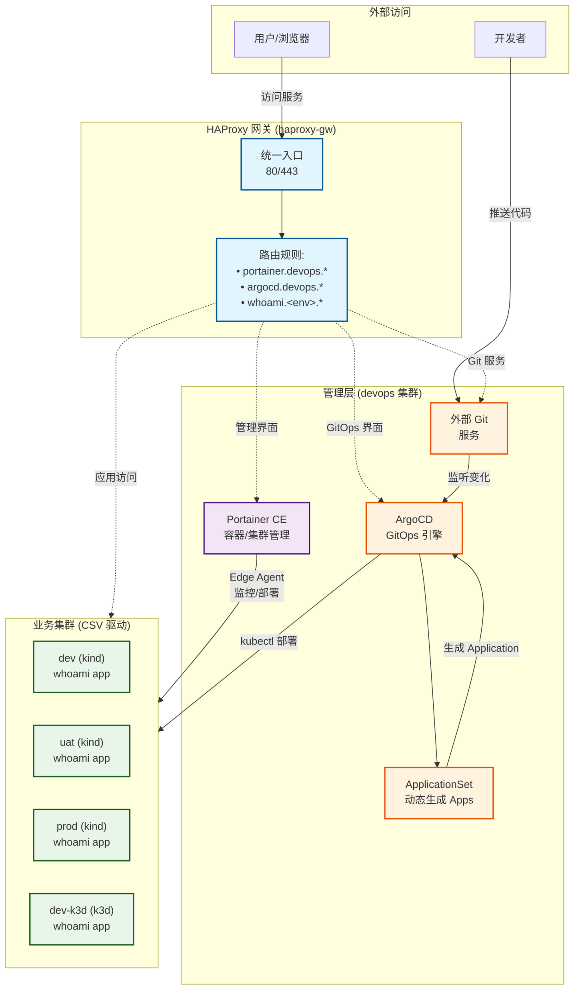
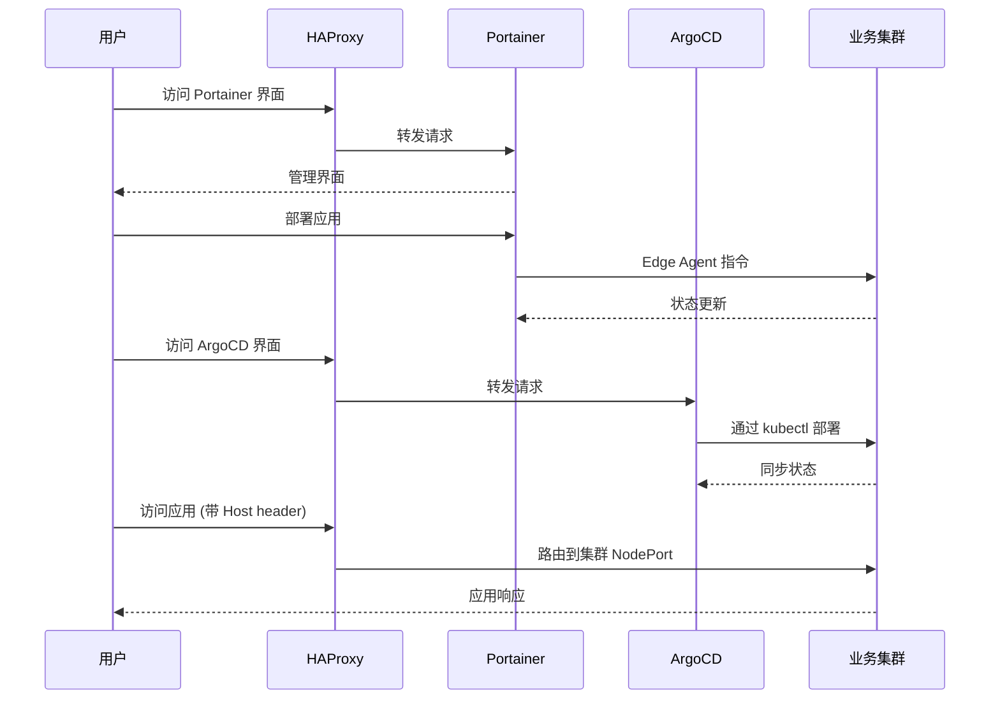

# Kindler

> 基于 Portainer CE、HAProxy 和 Kubernetes（kind/k3d）的轻量级本地开发环境编排工具

**Kindler** 提供了一种简单、快速、高效的方式,通过统一网关和管理界面来管理容器化应用和轻量级 Kubernetes 集群。

[中文文档](./README_CN.md) | [English](./README.md)

## 特性

- 🚀 **统一网关**: 通过 HAProxy 为所有服务提供单一入口点
- 🎯 **集中管理**: 通过 Portainer CE 管理容器和集群
- 🔄 **GitOps 就绪**: 内置 ArgoCD 用于声明式应用部署
- 🌐 **基于域名路由**: 自动配置 HAProxy 实现环境访问
- 🛠️ **灵活后端**: 支持 kind 和 k3d 两种 Kubernetes 发行版
- 📦 **自动注册**: 自动将集群注册到 Portainer 和 ArgoCD
- 🔒 **生产就绪**: 支持 TLS 和自动重定向
- 🔄 **统一 Ingress（NodePort）**：无论 k3d 还是 kind，均通过 NodePort 暴露入口，应用无需感知差异

## 架构

### 系统拓扑



> **说明**:
> - **HAProxy**: 统一网关，基于域名路由流量
> - **devops 集群**: 运行基础设施服务（Portainer、ArgoCD）
> - **业务集群**: 由 `config/environments.csv` 定义，自动注册到 Portainer 和 ArgoCD
> - **GitOps 流程**: 代码推送 → 外部 Git 服务 → ArgoCD 监听 → ApplicationSet 生成 → 自动部署

### 请求流程



## 快速开始

### 前置要求

- Docker Engine (20.10+)
- Docker Compose (v2.0+)
- kubectl (用于 k8s 集群管理)
- kind (v0.20+) 或 k3d (v5.6+) 之一

### 安装

1. **克隆仓库**
   ```bash
   git clone https://github.com/hofmannhe/kindler.git
   cd kindler
   ```

2. **配置环境** (可选，已提供合理默认值)
   ```bash
   # 根据需要编辑配置文件
   cp config/git.env.example config/git.env  # 外部 Git 配置模板
   nano config/git.env          # 填写 Git 仓库地址与凭证
   nano config/clusters.env    # HAProxy 主机、基础域名、版本
   nano config/secrets.env     # 管理员密码
   nano config/environments.csv # 集群定义
   ```

   **默认配置说明**：
   - `BASE_DOMAIN=192.168.51.30.sslip.io` (使用 sslip.io 免配置 DNS)
   - `HAPROXY_HOST=192.168.51.30` (HAProxy 主机 IP)
   - `HAPROXY_HTTP_PORT=80` (HTTP 端口，可选配置)
   - `HAPROXY_HTTPS_PORT=443` (HTTPS 端口，可选配置)

   > **域名方案**：默认使用 [sslip.io](https://sslip.io) 提供免配置 DNS 解析。
   > - ✅ **优点**：零配置，任何 IP 都能自动解析为域名
   > - ✅ **格式**：`<service>.<env>.<IP>.sslip.io` → 解析到 `<IP>`
   > - ⚠️ **纯内网环境**：如无法访问 sslip.io，可配置内网 DNS 或修改 `/etc/hosts`

3. **启动基础设施**
   ```bash
   ./scripts/bootstrap.sh
   ```
   该脚本将:
   - 启动 Portainer CE 容器
   - 启动 HAProxy 网关
   - 创建 `devops` 管理集群
   - 部署 ArgoCD (GitOps 引擎)
   - 校验 `config/git.env` 中配置的外部 Git 仓库

4. **一键拉起（含计时/健康检查，建议）**
   ```bash
   # 可选：先全量清理
   ./scripts/clean.sh

   # 一键全流程（含 bootstrap + 批量创建 CSV 环境）
   ./scripts/full_cycle.sh --concurrency 3
   ```

5. **访问管理界面**（基于域名，默认端口 80/443）

   **推荐方式（域名访问）**：
   - **Portainer**: https://portainer.devops.192.168.51.30.sslip.io
   - **ArgoCD**: http://argocd.devops.192.168.51.30.sslip.io

   **备用方式（IP + Host header）**：
   ```bash
   # Portainer (HTTP 自动跳转到 HTTPS)
   curl -H 'Host: portainer.devops.192.168.51.30.sslip.io' http://192.168.51.30

   # ArgoCD
   curl -H 'Host: argocd.devops.192.168.51.30.sslip.io' http://192.168.51.30
   ```

   **登录凭证**：
   - 用户名: `admin`
   - 密码: 查看 `config/secrets.env` 中的配置

### 手动创建/删除业务集群

```bash
# 创建单个环境（读取 CSV 默认）
./scripts/create_env.sh -n dev

# 批量创建（来自 CSV）
for env in dev uat prod dev-k3d uat-k3d prod-k3d; do ./scripts/create_env.sh -n "$env"; done

# 停止/启动（保留配置）
./scripts/stop_env.sh -n dev
./scripts/start_env.sh -n dev

# 永久删除（连带 CSV/Portainer/ArgoCD/HAProxy 清理）
./scripts/delete_env.sh -n dev
```

创建脚本将自动:
- ✅ 创建 Kubernetes 集群 (根据 CSV 配置选择 kind/k3d)
- ✅ 通过 Edge Agent 注册到 Portainer
- ✅ 使用 kubectl context 注册到 ArgoCD
- ✅ 配置 HAProxy 域名路由 (如果在 CSV 中启用)

### 访问集群与应用

**访问方式说明**：
- ✅ **默认：域名访问**（基于 sslip.io，零配置）
- ✅ **端口：80 (HTTP) / 443 (HTTPS)**（可通过 `HAPROXY_HTTP_PORT`/`HAPROXY_HTTPS_PORT` 自定义）
- ⚠️ **纯内网环境**：需配置内网 DNS 或 `/etc/hosts`

**管理界面访问**：
```bash
# Portainer (HTTPS，自签名证书)
https://portainer.devops.192.168.51.30.sslip.io

# ArgoCD (HTTP)
http://argocd.devops.192.168.51.30.sslip.io

# HAProxy 统计页面
http://haproxy.devops.192.168.51.30.sslip.io/stats
```

**业务应用访问**（示例：whoami，经 HAProxy Host 头访问）：
```bash
BASE=192.168.51.30
curl -I -H 'Host: whoami.dev.192.168.51.30.sslip.io'   http://$BASE
curl -I -H 'Host: whoami.uat.192.168.51.30.sslip.io'   http://$BASE
curl -I -H 'Host: whoami.prod.192.168.51.30.sslip.io'  http://$BASE
curl -I -H 'Host: whoami.devk3d.192.168.51.30.sslip.io'  http://$BASE
curl -I -H 'Host: whoami.uatk3d.192.168.51.30.sslip.io'  http://$BASE
curl -I -H 'Host: whoami.prodk3d.192.168.51.30.sslip.io' http://$BASE
```

**纯内网环境配置**（无法访问 sslip.io）：
```bash
# 方式1：修改 /etc/hosts
sudo tee -a /etc/hosts <<EOF
192.168.51.30 portainer.devops.local
192.168.51.30 argocd.devops.local
192.168.51.30 whoami.dev.local
192.168.51.30 whoami.uat.local
192.168.51.30 whoami.prod.local
EOF

# 方式2：使用内网 DNS 服务器
# 配置泛域名解析：*.devops.local → 192.168.51.30
# 然后修改 config/clusters.env:
# BASE_DOMAIN=local
```

## GitOps 工作流

Kindler 内置完整的 GitOps 工作流，实现代码到部署的自动化。

### 核心组件
- **外部 Git 服务**: 托管应用仓库，配置见 `config/git.env`
- **ArgoCD**: GitOps 引擎，监听 Git 变化并自动部署 (访问: http://argocd.devops.192.168.51.30.sslip.io)
- **ApplicationSet**: 动态生成 ArgoCD Applications，由 `config/environments.csv` 驱动

### 分支与环境映射

- 分支名 = 环境名。ArgoCD 将分支=<env> 的代码同步到集群=<env>。
- 示例：`dev`、`uat`、`prod`、`dev-k3d`、`uat-k3d`、`prod-k3d`。

### 快速体验

```bash
# 1. 确认 config/git.env 已指向外部 Git 仓库

# 2. 推送代码到对应环境分支（如 dev/uat/prod/...）
cd /path/to/your/app
git push origin develop

# 3. ArgoCD 自动检测并部署到 dev 环境
# 4. 查看 ArgoCD UI 监控部署进度
open http://argocd.devops.192.168.51.30.sslip.io

# 5. 验证部署结果
curl http://whoami.dev.192.168.51.30.sslip.io
```

### whoami 示例应用

将仓库示例（位于 `examples/whoami`）推送到外部 Git 服务，即可演示 GitOps 工作流：

- **仓库地址**: 在 `config/git.env` 中配置
- **推荐分支**: develop、release、master
- **应用类型**: Helm Chart (deploy/ 目录)
- **配置差异**: 仅域名不同，其他配置完全一致（最小化差异原则）

**访问示例**：
```bash
# 查看 dev 环境
curl http://whoami.dev.192.168.51.30.sslip.io

# 查看 uat 环境
curl http://whoami.uat.192.168.51.30.sslip.io

# 查看 prod 环境
curl http://whoami.prod.192.168.51.30.sslip.io
```

注意：
- `devops` 管理集群不部署 whoami，仅对 `config/environments.csv` 中的业务集群进行部署。
- 环境完全由 CSV 驱动，请勿在清单/脚本中硬编码环境名；使用 `scripts/sync_applicationset.sh` 自动生成。

> 📖 **详细文档**: [GitOps 工作流完整指南](./docs/GITOPS_WORKFLOW.md)

## 项目结构

```
kindler/
├── clusters/           # k3d/kind 集群配置
├── compose/            # Docker Compose 文件
│   ├── haproxy/       # HAProxy 网关设置
│   └── portainer/     # Portainer CE 设置
├── config/            # 配置文件
│   ├── environments.csv    # 环境定义
│   ├── clusters.env        # 集群镜像版本
│   ├── git.env.example     # 外部 Git 配置模板（复制为 git.env）
│   └── secrets.env         # 密码和令牌
├── scripts/           # 管理脚本
│   ├── bootstrap.sh        # 初始化基础设施
│   ├── create_env.sh       # 创建业务集群
│   ├── stop_env.sh         # 停止集群（保留配置）
│   ├── start_env.sh        # 启动已停止的集群
│   ├── delete_env.sh       # 永久删除集群（含 CSV 配置）
│   ├── clean.sh            # 清理所有资源
│   └── haproxy_sync.sh     # 同步 HAProxy 路由
├── manifests/         # Kubernetes 清单
│   └── argocd/        # ArgoCD 安装
└── tests/             # 测试脚本
```

## 配置

### 环境定义 (CSV)

编辑 `config/environments.csv` 定义您的环境:

```csv
# env,provider,node_port,pf_port,register_portainer,haproxy_route,http_port,https_port
dev,kind,30080,19001,true,true,18090,18443
uat,kind,30080,29001,true,true,28080,28443
prod,kind,30080,39001,true,true,38080,38443
dev-k3d,k3d,30080,19002,true,true,18091,18444
```

**列说明:**
- `env`: 环境名称 (唯一标识符)
- `provider`: `kind` 或 `k3d`
- `node_port`: 集群 Traefik NodePort (默认: 30080)
- `pf_port`: 端口转发本地端口 (用于调试)
- `register_portainer`: 自动注册到 Portainer (`true`/`false`)
- `haproxy_route`: 添加 HAProxy 域名路由 (`true`/`false`)
- `http_port`: 集群 HTTP 端口映射
- `https_port`: 集群 HTTPS 端口映射

### 集群镜像

在 `config/clusters.env` 中配置 Kubernetes 版本:

```bash
KIND_NODE_IMAGE=kindest/node:v1.31.12
K3D_IMAGE=rancher/k3s:v1.31.5-k3s1
```

### 端口配置

**默认端口（推荐）**：
- **HTTP**: `80`（通过 `HAPROXY_HTTP_PORT` 配置）
- **HTTPS**: `443`（通过 `HAPROXY_HTTPS_PORT` 配置）

**可选：自定义端口**：
如需修改端口，编辑 `config/clusters.env`：
```bash
HAPROXY_HTTP_PORT=8080   # 自定义 HTTP 端口
HAPROXY_HTTPS_PORT=8443  # 自定义 HTTPS 端口
```

**端口用途**：
- `80` (HTTP): ArgoCD、HAProxy Stats、业务应用、Portainer HTTP→HTTPS 跳转
- `443` (HTTPS): Portainer 管理界面（自签名证书）

> **注意**：修改端口后，访问 URL 需要带端口号，如 `http://argocd.devops.192.168.51.30.sslip.io:8080`

### 域名配置

**默认配置（推荐）**：
```bash
BASE_DOMAIN=192.168.51.30.sslip.io  # 使用 sslip.io 免配置 DNS
HAPROXY_HOST=192.168.51.30           # HAProxy 主机 IP
```

**域名格式**：`<service>.<env>.<BASE_DOMAIN>`
- 管理服务：`portainer.devops.192.168.51.30.sslip.io`
- 业务应用：`whoami.dev.192.168.51.30.sslip.io`

**纯内网环境配置**：
```bash
BASE_DOMAIN=local           # 使用本地域名
HAPROXY_HOST=192.168.51.30  # 内网 IP
```
需配合 `/etc/hosts` 或内网 DNS 使用。

## 管理命令

### 集群生命周期

#### 创建环境
```bash
# 创建集群 (使用 CSV 默认值)
./scripts/create_env.sh -n dev

# 创建集群 (覆盖选项)
./scripts/create_env.sh -n dev -p kind --node-port 30081 --no-register-portainer
```

#### 停止/启动环境（保留配置）
```bash
# 停止集群（保留 CSV 配置和 kubeconfig，释放资源）
./scripts/stop_env.sh -n dev

# 重启已停止的集群
./scripts/start_env.sh -n dev
```

> **用途**: 临时停止集群以节省资源，后续可快速恢复。适合开发时暂时不需要的环境。

#### 永久删除环境
```bash
# 永久删除集群（自动清理 CSV 配置、Portainer 注册、ArgoCD 注册、HAProxy 路由）
./scripts/delete_env.sh -n dev
```

> **警告**: 此操作会：
> - 删除 Kubernetes 集群
> - 从 `config/environments.csv` 移除配置
> - 注销 Portainer Edge Environment
> - 注销 ArgoCD 集群
> - 移除 HAProxy 路由
> - 自动同步 ApplicationSet（移除相关 Application）

#### 清理所有资源
```bash
# 清理所有资源 (集群、容器、网络、卷)
./scripts/clean.sh
```

### 三种操作对比

| 操作 | 集群运行 | CSV 配置 | Portainer | ArgoCD | 用途 |
|------|----------|----------|-----------|--------|------|
| **stop_env.sh** | ❌ 停止 | ✅ 保留 | ✅ 保留 | ✅ 保留 | 临时释放资源 |
| **start_env.sh** | ✅ 启动 | ✅ 使用 | ✅ 继续 | ✅ 继续 | 恢复已停止集群 |
| **delete_env.sh** | ❌ 删除 | ❌ 删除 | ❌ 注销 | ❌ 注销 | 永久移除环境 |

### HAProxy 路由管理

```bash
# 从 CSV 同步路由
./scripts/haproxy_sync.sh

# 同步并清理未列出的路由
./scripts/haproxy_sync.sh --prune
```

### Portainer 管理

```bash
# 启动/更新 Portainer
./scripts/portainer.sh up

# 手动添加端点
./scripts/portainer.sh add-endpoint myenv https://cluster-ip:9001
```

## 端口参考

| 服务 | 默认端口 | 协议 | 用途 | 可配置 |
|------|----------|------|------|--------|
| Portainer HTTP | 23380 | HTTP | 重定向到 HTTPS | 是 (haproxy.cfg) |
| Portainer HTTPS | 23343 | HTTPS | 管理界面 | 是 (haproxy.cfg) |
| ArgoCD | 23800 | HTTP | GitOps 界面 | 是 (haproxy.cfg) |
| 集群路由 | 23080 | HTTP | 基于域名的路由 | 是 (haproxy.cfg) |

> **注意**: 所有端口都可以通过编辑 `compose/infrastructure/haproxy.cfg` 并重启 HAProxy 来自定义。

## 验证

默认配置验证 (根据您的设置调整):

```bash
# 替换为您在 config/clusters.env 中的 HAPROXY_HOST
HAPROXY_HOST=192.168.51.30

# Portainer HTTPS
curl -kI https://${HAPROXY_HOST}
# 预期: HTTP/1.1 200 OK

# Portainer HTTP (重定向)
curl -I http://${HAPROXY_HOST}
# 预期: HTTP/1.1 301 Moved Permanently

# ArgoCD
curl -I http://${HAPROXY_HOST}
# 预期: HTTP/1.1 200 OK

# 集群路由 (带域名 header，根据需要调整 BASE_DOMAIN)
curl -H 'Host: dev.local' -I http://${HAPROXY_HOST}
# 预期: HTTP/1.1 200 OK (或后端服务响应)
```

## 高级用法

### 域名解析方案

Kindler 支持三种 DNS 解析策略:

#### 方案 1: sslip.io (零配置，推荐默认) ✅

使用公共 DNS 服务自动解析到您的 IP:

```bash
# config/clusters.env (默认)
BASE_DOMAIN=192.168.51.30.sslip.io
HAPROXY_HOST=192.168.51.30

# 直接访问服务
curl http://whoami.dev.192.168.51.30.sslip.io
curl http://whoami.uat.192.168.51.30.sslip.io
```

**优点:**
- 无需任何配置
- 安装后立即可用
- 适合多人协作环境
- 无需本地 DNS 设置

**缺点:**
- 域名较长
- DNS 解析需要互联网连接

#### 方案 2: 本地 /etc/hosts (简洁域名)

使用提供的脚本管理本地 DNS 条目:

```bash
# 修改 BASE_DOMAIN 为本地域名
nano config/clusters.env
# 设置: BASE_DOMAIN=local

# 同步所有环境到 /etc/hosts
sudo ./scripts/update_hosts.sh --sync

# 或添加单个环境
sudo ./scripts/update_hosts.sh --add dev

# 使用简洁域名访问
curl http://dev.local
curl http://uat.local

# 完成后清理
sudo ./scripts/update_hosts.sh --clean
```

**脚本用法:**
```bash
sudo ./scripts/update_hosts.sh --sync       # 从 CSV 同步所有环境
sudo ./scripts/update_hosts.sh --add dev    # 添加单个环境
sudo ./scripts/update_hosts.sh --remove dev # 移除环境
sudo ./scripts/update_hosts.sh --clean      # 移除所有 Kindler 条目
sudo ./scripts/update_hosts.sh --help       # 显示帮助
```

**优点:**
- 简洁的域名
- 完全本地化，无外部依赖
- 修改前自动备份 /etc/hosts

**缺点:**
- 需要 sudo 权限
- 需要手动执行脚本
- 每个开发者需在自己机器上运行

#### 方案 3: curl -H 方式 (测试用)

使用 Host header，无需 DNS 配置:

```bash
# 无需配置
curl -H 'Host: dev.local' http://192.168.51.30
curl -H 'Host: uat.local' http://192.168.51.30
```

**适用场景:** 快速测试和验证

### 多环境支持

Kindler 完全支持多个环境，自动配置 DNS 和 HAProxy 路由。

#### 示例：管理多个环境

```bash
# 当前在 config/environments.csv 中定义的环境
# devops, dev, uat, prod, dev-k3d, uat-k3d, prod-k3d 等

# 方案 1: 使用 sslip.io 访问 (默认，零配置)
curl http://dev.192.168.51.30.sslip.io
curl http://uat.192.168.51.30.sslip.io
curl http://prod.192.168.51.30.sslip.io

# 方案 2: 使用本地域名访问 (运行 update_hosts.sh 后)
sudo ./scripts/update_hosts.sh --sync  # 一次同步所有环境
curl http://dev.local
curl http://uat.local
curl http://prod.local
```

#### 添加新环境

1. **添加到 CSV** (`config/environments.csv`):
   ```csv
   staging,k3d,30080,25001,true,true,25080,25443
   ```

2. **创建集群**:
   ```bash
   ./scripts/create_env.sh -n staging
   ```
   自动完成:
   - 创建 k3d 集群
   - 通过 Edge Agent 注册到 Portainer
   - 注册到 ArgoCD
   - 添加 HAProxy 路由 (ACL + backend)

3. **立即访问**:
   ```bash
   # 使用 sslip.io (立即可用)
   curl http://whoami.staging.192.168.51.30.sslip.io

   # 使用本地域名 (先同步 hosts)
   sudo ./scripts/update_hosts.sh --add staging
   curl http://staging.local
   ```

#### HAProxy 路由配置

每个环境自动获得 HAProxy 配置:

```haproxy
# Frontend ACL (在 compose/infrastructure/haproxy.cfg)
frontend fe_kube_http
  bind *

  # 为每个环境自动生成
  acl host_dev  hdr_reg(host) -i ^[^.]+\\.dev\\.[^:]+
  use_backend be_dev if host_dev

  acl host_uat  hdr_reg(host) -i ^[^.]+\\.uat\\.[^:]+
  use_backend be_uat if host_uat

  acl host_prod  hdr_reg(host) -i ^[^.]+\\.prod\\.[^:]+
  use_backend be_prod if host_prod

# Backend 路由到集群 NodePort
backend be_dev
  server s1 <dev-cluster-ip>:30080

backend be_uat
  server s1 <uat-cluster-ip>:30080

backend be_prod
  server s1 <prod-cluster-ip>:30080
```

**工作原理:**
1. 用户访问 `http://dev.192.168.51.30.sslip.io`
2. DNS 解析到 `192.168.51.30` (HAProxy)
3. HAProxy 读取 Host header: `dev.192.168.51.30.sslip.io`
4. ACL `host_dev` 匹配 → 路由到 `be_dev` backend
5. 请求转发到 dev 集群容器 IP 的 30080 端口

**查看当前路由:**
```bash
docker exec haproxy-gw cat /usr/local/etc/haproxy/haproxy.cfg | grep -A 2 "acl host_"
```

**从 CSV 同步路由:**
```bash
./scripts/haproxy_sync.sh         # 添加缺失的路由
./scripts/haproxy_sync.sh --prune # 添加缺失 + 移除未列出的
```

### 自定义域名路由

使用自己的域名:

1. 在 `config/clusters.env` 中更新 `BASE_DOMAIN`:
   ```bash
   BASE_DOMAIN=k8s.example.com
   ```

2. 重新同步 HAProxy 路由:
   ```bash
   ./scripts/haproxy_sync.sh --prune
   ```

3. 通过自定义域名访问:
   ```bash
   curl -H 'Host: dev.k8s.example.com' http://192.168.51.30
   ```

### 多节点集群

编辑 `clusters/` 中的集群配置文件以添加 worker 节点:

```yaml
# clusters/dev-cluster.yaml (kind)
kind: Cluster
apiVersion: kind.x-k8s.io/v1alpha4
nodes:
  - role: control-plane
  - role: worker
  - role: worker
```

```yaml
# clusters/dev-k3d-cluster.yaml (k3d)
apiVersion: k3d.io/v1alpha5
kind: Simple
servers: 1
agents: 2
```

## 测试

为集群运行冒烟测试:

```bash
./scripts/smoke.sh dev
```

测试结果记录在 `docs/TEST_REPORT.md` 中。

## 故障排除

### Portainer Edge Agent 无法连接

1. 检查 Edge Agent 日志:
   ```bash
   kubectl logs -n portainer deploy/portainer-agent
   ```

2. 验证网络连接:
   ```bash
   docker network inspect k3d-dev
   ```

3. 确保 HAProxy 可以访问集群容器:
   ```bash
   docker network connect k3d-dev haproxy-gw
   ```

### HAProxy 路由不工作

1. 检查 HAProxy 配置:
   ```bash
   docker exec haproxy-gw cat /usr/local/etc/haproxy/haproxy.cfg
   ```

2. 验证后端健康状态:
   ```bash
   curl -I http://192.168.51.30/haproxy/stats
   ```

3. 重新同步路由:
   ```bash
   ./scripts/haproxy_sync.sh --prune
   ```

## 贡献

欢迎贡献! 请:

1. Fork 本仓库
2. 创建特性分支 (`git checkout -b feature/amazing-feature`)
3. 提交更改 (`git commit -m 'feat: add amazing feature'`)
4. 推送到分支 (`git push origin feature/amazing-feature`)
5. 开启 Pull Request

详细开发指南请参阅 [AGENTS.md](./AGENTS.md)。

## 许可证

本项目采用 Apache License 2.0 许可证 - 详见 [LICENSE](LICENSE) 文件。

## 致谢

- [Portainer CE](https://www.portainer.io/) - 容器管理平台
- [HAProxy](http://www.haproxy.org/) - 高性能负载均衡器
- [kind](https://kind.sigs.k8s.io/) - Kubernetes in Docker
- [k3d](https://k3d.io/) - k3s in Docker
- [ArgoCD](https://argo-cd.readthedocs.io/) - GitOps 持续交付

## 支持

- 📚 文档: [docs/](./docs/)
- 🐛 问题反馈: [GitHub Issues](https://github.com/hofmannhe/kindler/issues)
- 💬 讨论: [GitHub Discussions](https://github.com/hofmannhe/kindler/discussions)
