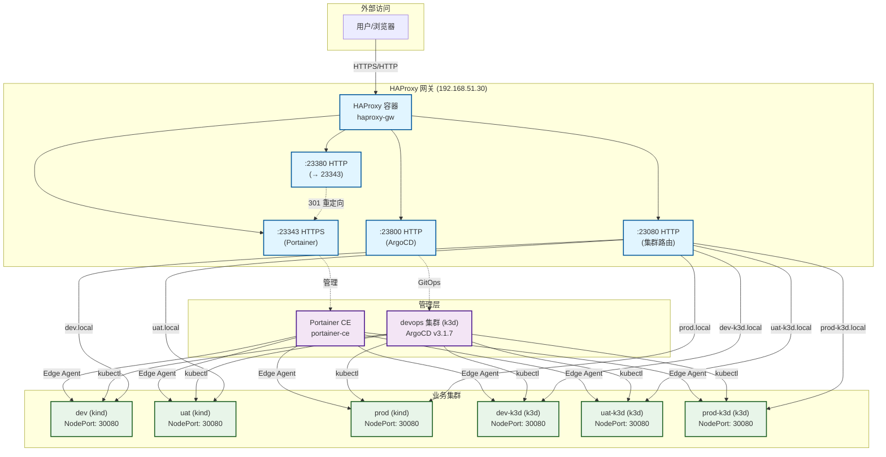
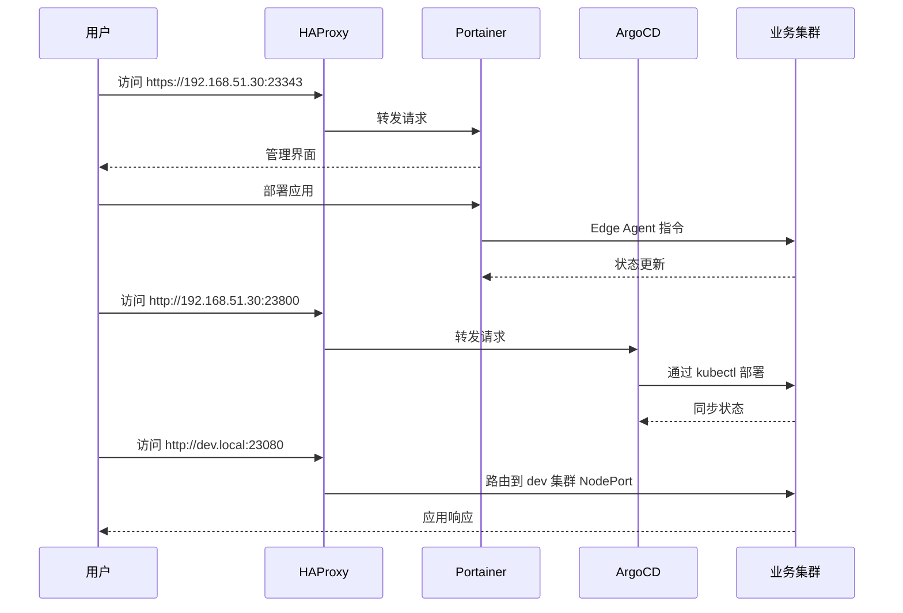

# Kindler

> 基于 Portainer CE、HAProxy 和 Kubernetes（kind/k3d）的轻量级本地开发环境编排工具

**Kindler** 提供了一种简单、快速、高效的方式,通过统一网关和管理界面来管理容器化应用和轻量级 Kubernetes 集群。

[中文文档](./README_CN.md) | [English](./README.md)

## 特性

- 🚀 **统一网关**: 通过 HAProxy 为所有服务提供单一入口点
- 🎯 **集中管理**: 通过 Portainer CE 管理容器和集群
- 🔄 **GitOps 就绪**: 内置 ArgoCD 用于声明式应用部署
- 🌐 **基于域名路由**: 自动配置 HAProxy 实现环境访问
- 🛠️ **灵活后端**: 支持 kind 和 k3d 两种 Kubernetes 发行版
- 📦 **自动注册**: 自动将集群注册到 Portainer 和 ArgoCD
- 🔒 **生产就绪**: 支持 TLS 和自动重定向

## 架构



### 架构概览



## 快速开始

### 前置要求

- Docker Engine (20.10+)
- Docker Compose (v2.0+)
- kubectl (用于 k8s 集群管理)
- kind (v0.20+) 或 k3d (v5.6+) 之一

### 安装

1. **克隆仓库**
   ```bash
   git clone https://github.com/hofmannhe/kindler.git
   cd kindler
   ```

2. **配置密钥**
   ```bash
   # 设置 Portainer 管理员密码 (默认: admin123)
   echo 'PORTAINER_ADMIN_PASSWORD=your-secure-password' > config/secrets.env

   # 配置 HAProxy 主机地址 (默认: 192.168.51.30)
   echo 'HAPROXY_HOST=192.168.51.30' >> config/clusters.env
   ```

3. **启动基础设施**
   ```bash
   ./scripts/bootstrap.sh
   ```
   该脚本将:
   - 启动 Portainer CE 容器
   - 启动 HAProxy 网关
   - 创建 `devops` k3d 集群
   - 部署 ArgoCD v3.1.7

4. **访问管理界面**
   - Portainer: `https://192.168.51.30:23343` (自签名证书)
   - ArgoCD: `http://192.168.51.30:23800`
     - 用户名: `admin`
     - 密码: 查看 `config/secrets.env` 中的 `ARGOCD_ADMIN_PASSWORD`

### 创建业务集群

创建 `config/environments.csv` 中定义的集群:

```bash
# 创建单个环境
./scripts/create_env.sh -n dev -p kind

# 从 CSV 创建所有环境
for env in dev uat prod dev-k3d uat-k3d prod-k3d; do
  ./scripts/create_env.sh -n $env
done
```

脚本将自动:
- ✅ 创建 Kubernetes 集群 (kind/k3d)
- ✅ 通过 Edge Agent 注册到 Portainer
- ✅ 使用 kubectl context 注册到 ArgoCD
- ✅ 配置 HAProxy 域名路由

### 访问集群

- **Portainer**: `https://192.168.51.30:23343`
- **ArgoCD**: `http://192.168.51.30:23800`
- **业务应用** (通过域名路由):
  ```bash
  curl -H 'Host: dev.local' http://192.168.51.30:23080
  curl -H 'Host: uat.local' http://192.168.51.30:23080
  curl -H 'Host: prod.local' http://192.168.51.30:23080
  ```

## 项目结构

```
kindler/
├── clusters/           # k3d/kind 集群配置
├── compose/            # Docker Compose 文件
│   ├── haproxy/       # HAProxy 网关设置
│   └── portainer/     # Portainer CE 设置
├── config/            # 配置文件
│   ├── environments.csv    # 环境定义
│   ├── clusters.env        # 集群镜像版本
│   └── secrets.env         # 密码和令牌
├── scripts/           # 管理脚本
│   ├── bootstrap.sh        # 初始化基础设施
│   ├── create_env.sh       # 创建业务集群
│   ├── delete_env.sh       # 删除集群
│   ├── clean.sh            # 清理所有资源
│   └── haproxy_sync.sh     # 同步 HAProxy 路由
├── manifests/         # Kubernetes 清单
│   └── argocd/        # ArgoCD 安装
└── tests/             # 测试脚本
```

## 配置

### 环境定义 (CSV)

编辑 `config/environments.csv` 定义您的环境:

```csv
# env,provider,node_port,pf_port,register_portainer,haproxy_route,http_port,https_port
dev,kind,30080,19001,true,true,18090,18443
uat,kind,30080,29001,true,true,28080,28443
prod,kind,30080,39001,true,true,38080,38443
dev-k3d,k3d,30080,19002,true,true,18091,18444
```

**列说明:**
- `env`: 环境名称 (唯一标识符)
- `provider`: `kind` 或 `k3d`
- `node_port`: 集群 Traefik NodePort (默认: 30080)
- `pf_port`: 端口转发本地端口 (用于调试)
- `register_portainer`: 自动注册到 Portainer (`true`/`false`)
- `haproxy_route`: 添加 HAProxy 域名路由 (`true`/`false`)
- `http_port`: 集群 HTTP 端口映射
- `https_port`: 集群 HTTPS 端口映射

### 集群镜像

在 `config/clusters.env` 中配置 Kubernetes 版本:

```bash
KIND_NODE_IMAGE=kindest/node:v1.31.12
K3D_IMAGE=rancher/k3s:stable
```

## 管理命令

### 集群生命周期

```bash
# 创建集群 (使用 CSV 默认值)
./scripts/create_env.sh -n dev

# 创建集群 (覆盖选项)
./scripts/create_env.sh -n dev -p kind --node-port 30081 --no-register-portainer

# 删除特定集群
./scripts/delete_env.sh -n dev -p kind

# 清理所有资源 (集群、容器、网络、卷)
./scripts/clean.sh
```

### HAProxy 路由管理

```bash
# 从 CSV 同步路由
./scripts/haproxy_sync.sh

# 同步并清理未列出的路由
./scripts/haproxy_sync.sh --prune
```

### Portainer 管理

```bash
# 启动/更新 Portainer
./scripts/portainer.sh up

# 手动添加端点
./scripts/portainer.sh add-endpoint myenv https://cluster-ip:9001
```

## 端口参考

| 服务 | 端口 | 协议 | 用途 |
|------|------|------|------|
| Portainer HTTP | 23380 | HTTP | 重定向到 23343 |
| Portainer HTTPS | 23343 | HTTPS | 管理界面 |
| ArgoCD | 23800 | HTTP | GitOps 界面 |
| 集群路由 | 23080 | HTTP | 基于域名的路由 |

## 验证

```bash
# Portainer HTTPS
curl -kI https://192.168.51.30:23343
# 预期: HTTP/1.1 200 OK

# Portainer HTTP (重定向)
curl -I http://192.168.51.30:23380
# 预期: HTTP/1.1 301 Moved Permanently

# ArgoCD
curl -I http://192.168.51.30:23800
# 预期: HTTP/1.1 200 OK

# 集群路由 (带域名 header)
curl -H 'Host: dev.local' -I http://192.168.51.30:23080
# 预期: HTTP/1.1 200 OK (或后端服务响应)
```

## 高级用法

### 自定义域名路由

默认情况下,集群通过 `<env>.local` 访问。使用自定义域名:

1. 在 `config/clusters.env` 中更新 `BASE_DOMAIN`:
   ```bash
   BASE_DOMAIN=k8s.example.com
   ```

2. 重新同步 HAProxy 路由:
   ```bash
   ./scripts/haproxy_sync.sh --prune
   ```

3. 通过自定义域名访问:
   ```bash
   curl -H 'Host: dev.k8s.example.com' http://192.168.51.30:23080
   ```

### 多节点集群

编辑 `clusters/` 中的集群配置文件以添加 worker 节点:

```yaml
# clusters/dev-cluster.yaml (kind)
kind: Cluster
apiVersion: kind.x-k8s.io/v1alpha4
nodes:
  - role: control-plane
  - role: worker
  - role: worker
```

```yaml
# clusters/dev-k3d-cluster.yaml (k3d)
apiVersion: k3d.io/v1alpha5
kind: Simple
servers: 1
agents: 2
```

## 测试

为集群运行冒烟测试:

```bash
./scripts/smoke.sh dev
```

测试结果记录在 `docs/TEST_REPORT.md` 中。

## 故障排除

### Portainer Edge Agent 无法连接

1. 检查 Edge Agent 日志:
   ```bash
   kubectl logs -n portainer deploy/portainer-agent
   ```

2. 验证网络连接:
   ```bash
   docker network inspect k3d-dev
   ```

3. 确保 HAProxy 可以访问集群容器:
   ```bash
   docker network connect k3d-dev haproxy-gw
   ```

### HAProxy 路由不工作

1. 检查 HAProxy 配置:
   ```bash
   docker exec haproxy-gw cat /usr/local/etc/haproxy/haproxy.cfg
   ```

2. 验证后端健康状态:
   ```bash
   curl -I http://192.168.51.30:23080/haproxy/stats
   ```

3. 重新同步路由:
   ```bash
   ./scripts/haproxy_sync.sh --prune
   ```

## 贡献

欢迎贡献! 请:

1. Fork 本仓库
2. 创建特性分支 (`git checkout -b feature/amazing-feature`)
3. 提交更改 (`git commit -m 'feat: add amazing feature'`)
4. 推送到分支 (`git push origin feature/amazing-feature`)
5. 开启 Pull Request

详细开发指南请参阅 [AGENTS.md](./AGENTS.md)。

## 许可证

本项目采用 Apache License 2.0 许可证 - 详见 [LICENSE](LICENSE) 文件。

## 致谢

- [Portainer CE](https://www.portainer.io/) - 容器管理平台
- [HAProxy](http://www.haproxy.org/) - 高性能负载均衡器
- [kind](https://kind.sigs.k8s.io/) - Kubernetes in Docker
- [k3d](https://k3d.io/) - k3s in Docker
- [ArgoCD](https://argo-cd.readthedocs.io/) - GitOps 持续交付

## 支持

- 📚 文档: [docs/](./docs/)
- 🐛 问题反馈: [GitHub Issues](https://github.com/hofmannhe/kindler/issues)
- 💬 讨论: [GitHub Discussions](https://github.com/hofmannhe/kindler/discussions)
