# Kindler

> 基于 Portainer CE、HAProxy 和 Kubernetes（kind/k3d）的轻量级本地开发环境编排工具

**Kindler** 提供了一种简单、快速、高效的方式，通过统一网关和管理界面来管理容器化应用和轻量级 Kubernetes 集群。

[English Reference](./README_EN.md)

## 语言与沟通 / Language & Communication

- 所有官方文档、脚本帮助、提交说明默认使用中文描述（参见 `openspec/specs/tooling-scripts/spec.md` 中的 *Chinese-First Communication* 要求）。
- 专业术语、命令、路径、标识符保持英文原样即可，避免歧义或错误翻译。
- 如确需补充英文内容，请在中文正文之后单独说明，明确其仅作参考而非主语种来源。

## 脚本总览

- 参见 `scripts/README.md` 获取分类的入口脚本、库脚本与弃用包装说明。
- 关键命令：`bootstrap.sh`、`cluster.sh`（create/delete/import/status/start/stop/list）、`create_env.sh`、`delete_env.sh`、`haproxy_route.sh`、`haproxy_sync.sh`、`reconcile.sh`、`reconcile_loop.sh`、`portainer.sh`、`argocd_register.sh`、`smoke.sh`。批量工具已迁移至 `tools/maintenance/`。

## 特性

- 🚀 **统一网关**: 通过 HAProxy 为所有服务提供单一入口点
- 🎯 **集中管理**: 通过 Portainer CE 管理容器和集群
- 🔄 **GitOps 就绪**: 内置 ArgoCD 用于声明式应用部署
- 🌐 **基于域名路由**: 自动配置 HAProxy 实现环境访问
- 🛠️ **灵活后端**: 支持 kind 和 k3d 两种 Kubernetes 发行版
- 📦 **自动注册**: 自动将集群注册到 Portainer 和 ArgoCD
- 🔒 **生产就绪**: 支持 TLS 和自动重定向
- 🔄 **统一 Ingress（NodePort）**：无论 k3d 还是 kind，均通过 NodePort 暴露入口，应用无需感知差异
- 🏢 **多项目管理**: 支持多个项目，提供命名空间隔离、资源配额和项目级路由
- 🔐 **项目隔离**: 每个项目运行在独立的命名空间中，配备 ResourceQuota 和 NetworkPolicy
- 🌐 **项目级路由**: 支持项目特定域名模式，如 `<service>.<project>.<env>.<BASE_DOMAIN>`

## 架构

### 系统拓扑

```mermaid
graph TB
    subgraph External["外部访问"]
        USER[用户/浏览器]
        DEV[开发者]
    end

    subgraph Gateway["HAProxy 网关 (haproxy-gw)"]
        HAP[统一入口<br/>80/443]
        ROUTES["路由规则:<br/>• portainer.devops.*<br/>• argocd.devops.*<br/>• whoami.&lt;env&gt;.*"]
    end

    subgraph Management["管理层 (devops 集群)"]
        PORT[Portainer CE<br/>容器/集群管理]
        GITSVC[外部 Git<br/>服务]
        ARGOCD[ArgoCD<br/>GitOps 引擎]
        APPSET[ApplicationSet<br/>动态生成 Apps]
    end

    subgraph Business["业务集群 (CSV 驱动)"]
        ENV1["dev (kind)<br/>whoami app"]
        ENV2["uat (kind)<br/>whoami app"]
        ENV3["prod (kind)<br/>whoami app"]
        ENV4["dev-k3d (k3d)<br/>whoami app"]
    end

    USER -->|访问服务| HAP
    DEV -->|推送代码| GITSVC

    HAP --> ROUTES
    ROUTES -.->|管理界面| PORT
    ROUTES -.->|GitOps 界面| ARGOCD
    ROUTES -.->|Git 服务| GITSVC
    ROUTES -.->|应用访问| Business

    PORT -->|Edge Agent<br/>监控/部署| Business

    GITSVC -->|监听变化| ARGOCD
    ARGOCD --> APPSET
    APPSET -->|生成 Application| ARGOCD
    ARGOCD -->|kubectl 部署| Business

    classDef gateway fill:#e1f5ff,stroke:#01579b,stroke-width:2px
    classDef management fill:#f3e5f5,stroke:#4a148c,stroke-width:2px
    classDef business fill:#e8f5e9,stroke:#1b5e20,stroke-width:2px
    classDef gitops fill:#fff3e0,stroke:#e65100,stroke-width:2px

    class HAP,ROUTES gateway
    class PORT management
    class GITSVC,ARGOCD,APPSET gitops
    class ENV1,ENV2,ENV3,ENV4 business
```



> **说明**:
> - **HAProxy**: 统一网关，基于域名路由流量
> - **devops 集群**: 运行基础设施服务（Portainer、ArgoCD）
> - **业务集群**: 由 `config/environments.csv` 定义，自动注册到 Portainer 和 ArgoCD
> - **GitOps 流程**: 代码推送 → 外部 Git 服务 → ArgoCD 监听 → ApplicationSet 生成 → 自动部署

### 请求流程

```mermaid
sequenceDiagram
    participant User as 用户
    participant HAProxy
    participant Portainer
    participant ArgoCD
    participant K8sCluster as 业务集群

    User->>HAProxy: 访问 Portainer 界面
    HAProxy->>Portainer: 转发请求
    Portainer-->>User: 管理界面

    User->>Portainer: 部署应用
    Portainer->>K8sCluster: Edge Agent 指令
    K8sCluster-->>Portainer: 状态更新

    User->>HAProxy: 访问 ArgoCD 界面
    HAProxy->>ArgoCD: 转发请求
    ArgoCD->>K8sCluster: 通过 kubectl 部署
    K8sCluster-->>ArgoCD: 同步状态

    User->>HAProxy: 访问应用 (带 Host header)
    HAProxy->>K8sCluster: 路由到集群 NodePort
    K8sCluster-->>User: 应用响应
```



## 快速开始

> 必做三步（回退/重装后建议先执行）
> 1) `./scripts/haproxy_sync.sh --prune`
> 2) `./tools/setup/setup_devops.sh`
> 3) `./scripts/sync_applicationset.sh`


### 前置要求

- Docker Engine (20.10+)
- Docker Compose (v2.0+)
- kubectl (用于 k8s 集群管理)
- kind (v0.20+) 或 k3d (v5.6+) 之一

### 安装

1. **克隆仓库**
   ```bash
   git clone https://github.com/hofmannhe/kindler.git
   cd kindler
   ```

2. **配置环境** (可选，已提供合理默认值)
   ```bash
   # 根据需要编辑配置文件
   cp config/git.env.example config/git.env  # 外部 Git 配置模板
   nano config/git.env          # 填写 Git 仓库地址与凭证
   nano config/clusters.env    # HAProxy 主机、基础域名、版本
   nano config/secrets.env     # 管理员密码
   nano config/environments.csv # 集群定义
   ```

   **默认配置说明**：
   - `BASE_DOMAIN=192.168.51.30.sslip.io` (使用 sslip.io 免配置 DNS)
   - `HAPROXY_HOST=192.168.51.30` (HAProxy 主机 IP)
   - `HAPROXY_HTTP_PORT=80` (HTTP 端口，可选配置)
   - `HAPROXY_HTTPS_PORT=443` (HTTPS 端口，可选配置)

   > **域名方案**：默认使用 [sslip.io](https://sslip.io) 提供免配置 DNS 解析。
   > - ✅ **优点**：零配置，任何 IP 都能自动解析为域名
   > - ✅ **格式**：`<service>.<env>.<IP>.sslip.io` → 解析到 `<IP>`
   > - ⚠️ **纯内网环境**：如无法访问 sslip.io，可配置内网 DNS 或修改 `/etc/hosts`

3. **启动基础设施**
   ```bash
   ./scripts/bootstrap.sh
   ```
   该脚本将:
   - 启动 Portainer CE 容器
   - 启动 HAProxy 网关
   - 创建 `devops` 管理集群
   - 部署 ArgoCD (GitOps 引擎)
   - 校验 `config/git.env` 中配置的外部 Git 仓库

### 声明式集群管理

- WebUI 采用声明式：仅写入 SQLite 数据库中的期望状态；由宿主机上的 Reconciler 调用与预置集群相同的 `scripts/create_env.sh` 完成实际创建与 Portainer/ArgoCD 注册。
- `bootstrap.sh` 会自动启动调和循环，可通过以下命令管理：
  - `./tools/start_reconciler.sh start|stop|status|logs`（内部调用 `scripts/reconcile_loop.sh --interval <值>`，输出记录在 `/tmp/kindler_reconciler.log`）。
  - 临时运行：`scripts/reconcile_loop.sh --once --prune-missing` 或结合 cron/systemd（示例：`*/5 * * * * cd ... && ./scripts/reconcile_loop.sh --interval 5m --max-runs 1`）。
  - 全量历史记录保存在 `logs/reconcile_history.jsonl`，可用 `scripts/reconcile.sh --last-run [--json]` 查看最近一次执行并在 PR/CI 描述中引用关键字段；如仍维护 `docs/TEST_REPORT.md`，可按需手工复制片段而非由脚本自动写入。
  - `logs/reconcile_history.jsonl` 不会自动轮转；如需裁剪请配置 logrotate 或执行 `truncate -s 0 logs/reconcile_history.jsonl`。
- 删除同样是声明式：`DELETE /api/clusters/{name}` 将把 `desired_state=absent`，Reconciler 删除集群并在完成后清理数据库记录。
 - P2 修复：bootstrap 会在 SQLite 中初始化 `devops` 集群的 `actual_state=running`（并记录 `last_reconciled_at`），确保 WebUI 正确显示管理集群状态。
 - 可选：如需在 `devops` 上部署业务，可在 bootstrap 前导出 `REGISTER_DEVOPS_ARGOCD=1`，系统将把 `devops` 注册到 ArgoCD（默认不注册；ApplicationSet 仍仅匹配业务集群）。

4. **一键拉起（含计时/健康检查，建议）**
   ```bash
   # 可选：先全量清理
   # 建议使用 --all 确保重置 Portainer 管理员（会清理 portainer_data/portainer_secrets 卷）
   ./scripts/clean.sh --all

   # 一键全流程（含 bootstrap + 批量创建 CSV 环境）
   ./scripts/full_cycle.sh --concurrency 3
   ```

5. **访问管理界面**（基于域名，默认端口 80/443）

   **推荐方式（域名访问）**：
   - **Portainer**: https://portainer.devops.192.168.51.30.sslip.io
   - **ArgoCD**: http://argocd.devops.192.168.51.30.sslip.io

   **备用方式（IP + Host header）**：
   ```bash
   # Portainer (HTTP 自动跳转到 HTTPS)
   curl -H 'Host: portainer.devops.192.168.51.30.sslip.io' http://192.168.51.30

   # ArgoCD
   curl -H 'Host: argocd.devops.192.168.51.30.sslip.io' http://192.168.51.30
   ```

   **登录凭证**：
   - 用户名: `admin`
   - 密码: 查看 `config/secrets.env` 中的配置

### 手动创建/删除业务集群

```bash
# 创建单个环境（读取 CSV 默认）
./scripts/create_env.sh -n dev

# 批量创建（来自 CSV）
for env in dev uat prod dev-k3d uat-k3d prod-k3d; do ./scripts/create_env.sh -n "$env"; done

# 停止/启动（保留配置）
./scripts/cluster.sh stop dev
./scripts/cluster.sh start dev

# 永久删除（连带 CSV/Portainer/ArgoCD/HAProxy 清理）
./scripts/delete_env.sh -n dev
```

创建脚本将自动:
- ✅ 创建 Kubernetes 集群 (根据 CSV 配置选择 kind/k3d)
- ✅ 通过 Edge Agent 注册到 Portainer
- ✅ 使用 kubectl context 注册到 ArgoCD
- ✅ 配置 HAProxy 域名路由（运行期以 SQLite `clusters` 为准；CSV 仅在 bootstrap 导入）

### 访问集群与应用

**访问方式说明**：
- ✅ **默认：域名访问**（基于 sslip.io，零配置）
- ✅ **端口：80 (HTTP) / 443 (HTTPS)**（可通过 `HAPROXY_HTTP_PORT`/`HAPROXY_HTTPS_PORT` 自定义）
- ⚠️ **纯内网环境**：需配置内网 DNS 或 `/etc/hosts`

**管理界面访问**：
```bash
# Portainer (HTTPS，自签名证书)
https://portainer.devops.192.168.51.30.sslip.io

# ArgoCD (HTTP)
http://argocd.devops.192.168.51.30.sslip.io

# HAProxy 统计页面
http://haproxy.devops.192.168.51.30.sslip.io/stats
```

**业务应用访问**（示例：whoami，经 HAProxy Host 头访问）：
```bash
BASE=192.168.51.30
curl -I -H 'Host: whoami.dev.192.168.51.30.sslip.io'   http://$BASE
curl -I -H 'Host: whoami.uat.192.168.51.30.sslip.io'   http://$BASE
curl -I -H 'Host: whoami.prod.192.168.51.30.sslip.io'  http://$BASE
curl -I -H 'Host: whoami.devk3d.192.168.51.30.sslip.io'  http://$BASE
curl -I -H 'Host: whoami.uatk3d.192.168.51.30.sslip.io'  http://$BASE
curl -I -H 'Host: whoami.prodk3d.192.168.51.30.sslip.io' http://$BASE
```

**纯内网环境配置**（无法访问 sslip.io）：
```bash
# 方式1：修改 /etc/hosts
sudo tee -a /etc/hosts <<EOF
192.168.51.30 portainer.devops.local
192.168.51.30 argocd.devops.local
192.168.51.30 whoami.dev.local
192.168.51.30 whoami.uat.local
192.168.51.30 whoami.prod.local
EOF

# 方式2：使用内网 DNS 服务器
# 配置泛域名解析：*.devops.local → 192.168.51.30
# 然后修改 config/clusters.env:
# BASE_DOMAIN=local
```

## GitOps 工作流

Kindler 内置完整的 GitOps 工作流，实现代码到部署的自动化。

### 核心组件
- **外部 Git 服务**: 托管应用仓库，配置见 `config/git.env`
- **ArgoCD**: GitOps 引擎，监听 Git 变化并自动部署 (访问: http://argocd.devops.192.168.51.30.sslip.io)
- **ApplicationSet**: 动态生成 ArgoCD Applications，由 `config/environments.csv` 驱动

### 分支与环境映射

- 分支名 = 环境名。ArgoCD 将分支=<env> 的代码同步到集群=<env>。
- 示例：`dev`、`uat`、`prod`、`dev-k3d`、`uat-k3d`、`prod-k3d`。

### 快速体验

```bash
# 1. 确认 config/git.env 已指向外部 Git 仓库

# 2. 推送代码到对应环境分支（如 dev/uat/prod/...）
cd /path/to/your/app
git push origin develop

# 3. ArgoCD 自动检测并部署到 dev 环境
# 4. 查看 ArgoCD UI 监控部署进度
open http://argocd.devops.192.168.51.30.sslip.io

# 5. 验证部署结果
curl http://whoami.dev.192.168.51.30.sslip.io
```

### whoami 示例应用

将仓库示例（位于 `examples/whoami`）推送到外部 Git 服务，即可演示 GitOps 工作流：

- **仓库地址**: 在 `config/git.env` 中配置
- **推荐分支**: develop、release、master
- **应用类型**: Helm Chart (deploy/ 目录)
- **配置差异**: 仅域名不同，其他配置完全一致（最小化差异原则）

**访问示例**：
```bash
# 查看 dev 环境
curl http://whoami.dev.192.168.51.30.sslip.io

# 查看 uat 环境
curl http://whoami.uat.192.168.51.30.sslip.io

# 查看 prod 环境
curl http://whoami.prod.192.168.51.30.sslip.io
```

注意：
- `devops` 管理集群不部署 whoami，仅对 `config/environments.csv` 中的业务集群进行部署。
- 环境完全由 CSV 驱动，请勿在清单/脚本中硬编码环境名；使用 `scripts/sync_applicationset.sh` 自动生成。

> 📖 **详细文档**: [GitOps 工作流完整指南](./docs/GITOPS_WORKFLOW.md)

### 并发创建与最终收敛

- `scripts/create_env.sh` 支持不同环境的并发创建，并具备幂等性。
- 并发安全：
  - HAProxy 路由写入内置文件锁；`haproxy_sync.sh` 增加全局锁，确保仅一次重载。
  - ApplicationSet 生成使用锁避免并发写覆盖。
  - GitOps 推送/归档采用全局锁串行化，避免远端竞争。
- 批量创建最佳实践：并发创建完成后执行一次最终收敛：
  ```bash
  ./scripts/reconcile_loop.sh --once   # 封装 reconcile.sh --from-db，并负责 ApplicationSet/HAProxy 同步
  ```

仓库范围澄清：
- Kindler 仓库（本仓库）：仅包含基础设施与脚本；不引入“生效/归档分支”。
- GitOps 仓库（外部仓库，配置于 `config/git.env`）：必须执行“生效（= SQLite clusters 除 devops）/归档（archive/<env>-<timestamp>）”策略；由 `tools/git/sync_git_from_db.sh` 强制实施。

### 声明式生命周期（Clean → Bootstrap → Reconcile → Validate）

SQLite 是唯一可信源。任何清理或手工改动后，都必须通过调和脚本把实际集群拉回到数据库描述的状态。

1. **Clean**：`scripts/clean.sh --all`
2. **Bootstrap**：`scripts/bootstrap.sh`
3. **Reconcile**：
   - 运行 `scripts/reconcile_loop.sh --once [--prune-missing] [...]`；它会调用 `scripts/reconcile.sh --from-db`，随后执行 Git 分支同步、ApplicationSet 渲染与 HAProxy prune，确保业务集群 ≥3 个 `k3d` / ≥3 个 `kind`。
   - 每次运行都会将 JSON 条目追加到 `logs/reconcile_history.jsonl`（含时间、参数、动作统计）。通过 `scripts/reconcile.sh --last-run` 或 `--last-run --json` 可立即查看最近一次调和摘要，并将关键信息复制到 PR/CI 描述中；默认不再自动写入 `docs/TEST_REPORT.md`。
   - `--dry-run` 仅打印计划并在存在漂移时返回非零；`--prune-missing` 则删除数据库中已无对应集群的陈旧记录。
4. **Validate**：
   - `scripts/test_sqlite_migration.sh` 检查迁移后的列（`desired_state`/`actual_state`/`last_reconciled_at` 等）以及 `devops` 记录。
   - `scripts/db_verify.sh --json-summary` 现在使用退出码 `0`（正常）/`10`（缺少集群）/`11`（状态漂移），并输出 `DB_VERIFY_SUMMARY=...`。
   - `scripts/create_env.sh` / `scripts/delete_env.sh` 在成功后会自动运行 `scripts/db_verify.sh --json-summary`（最多重试 3 次）；如需临时跳过可显式设置 `SKIP_DB_VERIFY=1`。
   - `scripts/test_data_consistency.sh --json-summary` 覆盖数据库/集群/ApplicationSet/Portainer/ArgoCD 并生成 `CONSISTENCY_SUMMARY=...`。

`tests/regression_test.sh` 已将以上流程自动化：清理 → 启动 → `scripts/reconcile_loop.sh --once` → 校验集群数量 → 运行全量验证，并通过 stdout/JSON 暴露 `RECONCILE_SUMMARY=...` 与最新 `--last-run --json` 结果，便于在 PR/CI 描述中引用；如确需 Markdown 报告，可显式使用 `--report` 或 `TEST_REPORT_OUTPUT` 生成一次性文件（例如 `docs/TEST_REPORT.md`）。

## 项目结构

```
kindler/
├── clusters/           # k3d/kind 集群配置
├── compose/            # Docker Compose 文件
│   ├── haproxy/       # HAProxy 网关设置
│   └── portainer/     # Portainer CE 设置
├── config/            # 配置文件
│   ├── environments.csv    # 环境定义
│   ├── clusters.env        # 集群镜像版本
│   ├── git.env.example     # 外部 Git 配置模板（复制为 git.env）
│   └── secrets.env         # 密码和令牌
├── scripts/           # 管理脚本
│   ├── bootstrap.sh        # 初始化基础设施
│   ├── create_env.sh       # 创建业务集群
│   ├── cluster.sh          # 集群生命周期调度（create/start/stop/list/...）
│   ├── delete_env.sh       # 永久删除集群（含 CSV 配置）
│   ├── clean.sh            # 清理所有资源
│   └── haproxy_sync.sh     # 同步 HAProxy 路由
├── manifests/         # Kubernetes 清单
│   └── argocd/        # ArgoCD 安装
└── tests/             # 测试脚本
```

## 配置

### 环境定义 (CSV)

编辑 `config/environments.csv` 定义您的环境:

```csv
# env,provider,node_port,pf_port,register_portainer,haproxy_route,http_port,https_port
dev,kind,30080,19001,true,true,18090,18443
uat,kind,30080,29001,true,true,28080,28443
prod,kind,30080,39001,true,true,38080,38443
dev-k3d,k3d,30080,19002,true,true,18091,18444
```

**列说明:**
- `env`: 环境名称 (唯一标识符)
- `provider`: `kind` 或 `k3d`
- `node_port`: 集群 Traefik NodePort (默认: 30080)
- `pf_port`: 端口转发本地端口 (用于调试)
- `register_portainer`: 自动注册到 Portainer (`true`/`false`)
- `haproxy_route`: 添加 HAProxy 域名路由 (`true`/`false`)
- `http_port`: 集群 HTTP 端口映射
- `https_port`: 集群 HTTPS 端口映射

### 集群镜像

在 `config/clusters.env` 中配置 Kubernetes 版本:

```bash
KIND_NODE_IMAGE=kindest/node:v1.31.12
K3D_IMAGE=rancher/k3s:v1.31.5-k3s1
```

## 开发流程（Git Worktree）

- 根目录仅承载稳定分支 `master`（或 `main`），用于实际部署与发布，保持产物稳定可预期。
- 功能开发采用 Git worktree 模式，在本地的 `worktrees/` 目录（已加入 `.gitignore`）下为每个开发分支创建一个工作树，开发与部署相互隔离。

快速上手
```bash
# 0) 准备本地目录（已被 .gitignore 忽略）
mkdir -p worktrees

# 1) 为功能分支创建并挂载工作树
git worktree add worktrees/feature-x feature/x

# 2) 在工作树中进行开发
cd worktrees/feature-x
# ... 常规开发/提交/推送 ...

# 3) 完成后移除工作树
cd -
git worktree remove worktrees/feature-x
git branch -D feature/x   # 可选，若分支已合并且不再需要
```

注意事项
- CI、脚本与部署流程均不依赖 `worktrees/` 目录中的任何文件。
- 根目录脚本与文档始终针对稳定的 `master/main` 分支。

## 用户配置指南

### 更换主机 / 切换新的 IP

方案 A — 使用 sslip.io（零配置 DNS，推荐）
- 编辑 `config/clusters.env`：
  - `HAPROXY_HOST=<新IP>`（例 `192.168.88.10`）
  - `BASE_DOMAIN=<新IP>.sslip.io`（例 `192.168.88.10.sslip.io`）

方案 B — 使用本地域名
- 编辑 `config/clusters.env`：
  - `HAPROXY_HOST=<新IP>`
  - `BASE_DOMAIN=local`
- 更新 `/etc/hosts`（或内网 DNS）：将 `portainer.devops.local`、`argocd.devops.local`、`whoami.<env>.local` 指向新 IP。

方案 C — 一键脚本
```bash
# 为默认网卡临时增加别名并切换到 192.168.51.35
# (ip 别名需要 root；如无权限可去掉 --add-alias)
sudo ./tools/reconfigure_host.sh --host-ip 192.168.51.35 --sslip --add-alias
```

修改 `clusters.env` 后的最小操作（手动路径）
```bash
# 1) 同步 HAProxy 路由
./scripts/haproxy_sync.sh --prune   # SQLite 为源，DB 不可用时临时回退 CSV

# 2) 更新 devops 集群的 ArgoCD Ingress（按 BASE_DOMAIN 重建）
./tools/setup/setup_devops.sh

# 3) 重新生成业务集群 ApplicationSet（更新 Ingress host）
./scripts/sync_applicationset.sh

# 4) 验证（以 sslip.io 为例）
BASE=<新IP>
curl -I -H "Host: portainer.devops.$BASE.sslip.io" http://$BASE   # 301
curl -I -H "Host: argocd.devops.$BASE.sslip.io"  http://$BASE     # 200/302
curl -I -H "Host: whoami.dev.$BASE.sslip.io"     http://$BASE     # 200
```

说明
- 仅更换 IP/域名时，无需重建集群；HAProxy 与 Ingress host 均由 `BASE_DOMAIN` 推导，按上述脚本刷新即可。
- 如外部端口也调整，请在 `config/clusters.env` 设置 `HAPROXY_HTTP_PORT`/`HAPROXY_HTTPS_PORT` 并重启 compose：
  ```bash
  docker compose -f compose/infrastructure/docker-compose.yml down && \
  docker compose -f compose/infrastructure/docker-compose.yml up -d
  ```

（可选）全量重拉起
```bash
./scripts/clean.sh
./scripts/full_cycle.sh --concurrency 3
```

## 开发流程（Git Worktree）

- 根目录仅承载稳定分支 `master`（或 `main`），用于实际部署与发布，保持产物稳定可预期。
- 功能开发采用 Git worktree 模式，在本地的 `worktrees/` 目录（已加入 `.gitignore`）下为每个开发分支创建一个工作树，开发与部署相互隔离。

快速上手
```bash
# 0) 准备本地目录（已被 .gitignore 忽略）
mkdir -p worktrees

# 1) 为功能分支创建并挂载工作树
git worktree add worktrees/feature-x feature/x

# 2) 在工作树中进行开发
cd worktrees/feature-x
# ... 常规开发/提交/推送 ...

# 3) 完成后移除工作树
cd -
git worktree remove worktrees/feature-x
git branch -D feature/x   # 可选，若分支已合并且不再需要
```

注意事项
- CI、脚本与部署流程均不依赖 `worktrees/` 目录中的任何文件。
- 根目录脚本与文档始终针对稳定的 `master/main` 分支。

### 端口配置

**默认端口（推荐）**：
- **HTTP**: `80`（通过 `HAPROXY_HTTP_PORT` 配置）
- **HTTPS**: `443`（通过 `HAPROXY_HTTPS_PORT` 配置）

**可选：自定义端口**：
如需修改端口，编辑 `config/clusters.env`：
```bash
HAPROXY_HTTP_PORT=8080   # 自定义 HTTP 端口
HAPROXY_HTTPS_PORT=8443  # 自定义 HTTPS 端口
```

**端口用途**：
- `80` (HTTP): ArgoCD、HAProxy Stats、业务应用、Portainer HTTP→HTTPS 跳转
- `443` (HTTPS): Portainer 管理界面（自签名证书）

> **注意**：修改端口后，访问 URL 需要带端口号，如 `http://argocd.devops.192.168.51.30.sslip.io:8080`

### 域名配置

**默认配置（推荐）**：
```bash
BASE_DOMAIN=192.168.51.30.sslip.io  # 使用 sslip.io 免配置 DNS
HAPROXY_HOST=192.168.51.30           # HAProxy 主机 IP
```

**域名格式**：`<service>.<env>.<BASE_DOMAIN>`

- **管理服务**（devops 环境）：
  - Portainer: `portainer.devops.$BASE_DOMAIN` (如 `portainer.devops.192.168.51.30.sslip.io`)
  - ArgoCD: `argocd.devops.$BASE_DOMAIN`
  - HAProxy 统计: `haproxy.devops.$BASE_DOMAIN/stat`
  - Git 服务: `git.devops.$BASE_DOMAIN`
  - **Web UI (Kindler)**: `kindler.devops.$BASE_DOMAIN` ⚠️ **重要：Web UI 使用 "kindler" 不是 "webui"**

- **业务服务**（集群相关）：
  - 示例 whoami 应用: `whoami.<集群名称>.$BASE_DOMAIN` (如 `whoami.dev.192.168.51.30.sslip.io`)
  - 使用完整集群名（包括 provider 后缀如 `-k3d` 或 `-kind`）

**纯内网环境配置**：
```bash
BASE_DOMAIN=local           # 使用本地域名
HAPROXY_HOST=192.168.51.30  # 内网 IP
```
需配合 `/etc/hosts` 或内网 DNS 使用。

## 多项目管理

Kindler 支持多项目管理，允许在同一个基础设施上运行多个独立的项目，并提供适当的隔离。

### 项目管理命令

#### 创建项目
```bash
./tools/project_manage.sh create \
  --project demo-app \
  --env dev-k3d \
  --team backend \
  --cpu-limit 2 \
  --memory-limit 4Gi \
  --description "演示应用"
```

#### 列出项目
```bash
# 列出所有项目
./tools/project_manage.sh list

# 列出指定环境的项目
./tools/project_manage.sh list --env dev-k3d
```

#### 查看项目详情
```bash
./tools/project_manage.sh show --project demo-app --env dev-k3d
```

#### 删除项目
```bash
./tools/project_manage.sh delete --project demo-app --env dev-k3d
```

### 项目级 HAProxy 路由

#### 添加项目路由
```bash
./tools/legacy/haproxy_project_route.sh add demo-app --env dev-k3d --node-port 30080
```

#### 移除项目路由
```bash
./tools/legacy/haproxy_project_route.sh remove demo-app --env dev-k3d
```

### ArgoCD 项目管理

#### 创建 AppProject
```bash
./tools/argocd_project.sh create \
  --project demo-app \
  --repo https://github.com/example/demo-app.git \
  --namespace project-demo-app
```

#### 添加应用
```bash
./tools/argocd_project.sh add-app \
  --project demo-app \
  --app whoami \
  --path deploy/ \
  --env dev-k3d
```

### 项目隔离特性

- **命名空间隔离**: 每个项目运行在独立的 Kubernetes 命名空间中
- **资源配额**: 每个项目的 CPU 和内存限制
- **网络策略**: 控制项目间的网络访问
- **项目级域名**: 支持 `<service>.<project>.<env>.<BASE_DOMAIN>` 模式

详细文档请参考 [PROJECT_MANAGEMENT.md](./docs/PROJECT_MANAGEMENT.md)。

## 管理命令

### 集群生命周期

#### 创建环境
```bash
# 创建集群 (使用 CSV 默认值)
./scripts/create_env.sh -n dev

# 创建集群 (覆盖选项)
./scripts/create_env.sh -n dev -p kind --node-port 30081 --no-register-portainer
```

#### 停止/启动环境（保留配置）
```bash
# 停止集群（保留 CSV 配置和 kubeconfig，释放资源）
./scripts/cluster.sh stop dev

# 重启已停止的集群
./scripts/cluster.sh start dev
```

> **用途**: 临时停止集群以节省资源，后续可快速恢复。适合开发时暂时不需要的环境。

#### 永久删除环境
```bash
# 永久删除集群（自动清理 CSV 配置、Portainer 注册、ArgoCD 注册、HAProxy 路由）
./scripts/delete_env.sh -n dev
```

> **警告**: 此操作会：
> - 删除 Kubernetes 集群
> - 从 `config/environments.csv` 移除配置
> - 注销 Portainer Edge Environment
> - 注销 ArgoCD 集群
> - 移除 HAProxy 路由
> - 自动同步 ApplicationSet（移除相关 Application）

#### 清理所有资源
```bash
# 清理所有资源 (集群、容器、网络、卷)
./scripts/clean.sh
```

### 三种操作对比

| 操作 | 集群运行 | CSV 配置 | Portainer | ArgoCD | 用途 |
|------|----------|----------|-----------|--------|------|
| **cluster.sh stop** | ❌ 停止 | ✅ 保留 | ✅ 保留 | ✅ 保留 | 临时释放资源 |
| **cluster.sh start** | ✅ 启动 | ✅ 使用 | ✅ 继续 | ✅ 继续 | 恢复已停止集群 |
| **delete_env.sh** | ❌ 删除 | ❌ 删除 | ❌ 注销 | ❌ 注销 | 永久移除环境 |

### HAProxy 路由管理

```bash
# 从 CSV 同步路由
./scripts/haproxy_sync.sh

# 同步并清理未列出的路由
./scripts/haproxy_sync.sh --prune
```

### Portainer 管理

```bash
# 启动/更新 Portainer
./scripts/portainer.sh up

# 手动添加端点
./scripts/portainer.sh add-endpoint myenv https://cluster-ip:9001
```

## 端口参考

| 服务 | 默认端口 | 协议 | 用途 | 可配置 |
|------|----------|------|------|--------|
| Portainer HTTP | 23380 | HTTP | 重定向到 HTTPS | 是 (haproxy.cfg) |
| Portainer HTTPS | 23343 | HTTPS | 管理界面 | 是 (haproxy.cfg) |
| ArgoCD | 23800 | HTTP | GitOps 界面 | 是 (haproxy.cfg) |
| 集群路由 | 23080 | HTTP | 基于域名的路由 | 是 (haproxy.cfg) |

> **注意**: 所有端口都可以通过编辑 `compose/infrastructure/haproxy.cfg` 并重启 HAProxy 来自定义。

## 验证

默认配置验证 (根据您的设置调整):

```bash
# 替换为您在 config/clusters.env 中的 HAPROXY_HOST
HAPROXY_HOST=192.168.51.30

# Portainer HTTPS
curl -kI https://${HAPROXY_HOST}
# 预期: HTTP/1.1 200 OK

# Portainer HTTP (重定向)
curl -I http://${HAPROXY_HOST}
# 预期: HTTP/1.1 301 Moved Permanently

# ArgoCD
curl -I http://${HAPROXY_HOST}
# 预期: HTTP/1.1 200 OK

# 集群路由 (带域名 header，根据需要调整 BASE_DOMAIN)
curl -H 'Host: dev.local' -I http://${HAPROXY_HOST}
# 预期: HTTP/1.1 200 OK (或后端服务响应)
```

## 运维操作

- Portainer 管理员密码
  - 在 `config/secrets.env` 配置 `PORTAINER_ADMIN_PASSWORD`（明文）。
  - 运行 `./scripts/portainer.sh up` 会把密码写入命名卷 `portainer_secrets:/run/secrets/portainer_admin` 并启动 Portainer。
  - 轮换/重置管理员密码：更新 `config/secrets.env` 后执行 `./scripts/portainer.sh reset-admin`（会重建数据卷并重新应用密码）。

- 在 Portainer 中查看 devops 集群
  - `bootstrap.sh` 会以 Edge Agent 方式把 devops（管理）集群注册到 Portainer，便于从 Portainer 观察 ArgoCD 等核心组件。
  - 可通过环境变量关闭：`REGISTER_DEVOPS_PORTAINER=0 ./scripts/bootstrap.sh`（跳过注册）。
  - 随时手动注册：`./tools/setup/register_edge_agent.sh devops k3d`。

- HAProxy 路由（数据库驱动）
  - 运行期以 SQLite 数据库 `clusters` 表为唯一真实来源；CSV 仅在 bootstrap 时导入（DB 临时不可用时回退）。
  - 集群新增/删除后执行 `./scripts/haproxy_sync.sh --prune` 同步（幂等、单次 reload）。
  - `compose/infrastructure/haproxy.cfg` 中的动态区块默认留空，由脚本完全管理以避免陈旧条目；`setup_devops.sh` 会将 ArgoCD backend 自动重写为当前 devops 节点 IP/NodePort。
  - 已启用 Docker DNS 解析器（`resolvers docker`）与后端懒解析（如 `init-addr none`），启动时若后端容器名暂不可解析不会导致 HAProxy 重启；后端就绪后自动生效。
  - 若出现异常路由（如 `use_backend` 指向不存在的 backend），执行 `./scripts/haproxy_sync.sh --prune` 可自动清理悬挂条目并恢复稳定。

- WebUI 健康检查
  - WebUI 前端健康检查使用 `curl -sf http://localhost/`（替换原先的 wget），减少不必要的 Unhealthy 抖动。
  - 访问 WebUI：`curl -I -H "Host: kindler.devops.$BASE_DOMAIN" http://$HAPROXY_HOST` 预期 200。

- 全量回归（从零开始）
  - 完整校验流程：
  ```bash
  ./scripts/clean.sh --all
  ./scripts/bootstrap.sh
    # 至少创建 ≥3 个 kind 与 ≥3 个 k3d（从 CSV 读取）
    awk -F, 'NR>1 && $2=="kind" {print $1}' config/environments.csv | head -3 | xargs -r -n1 ./scripts/create_env.sh -n
    awk -F, 'NR>1 && $2=="k3d"  {print $1}' config/environments.csv | head -3 | xargs -r -n1 ./scripts/create_env.sh -n
    ./scripts/haproxy_sync.sh --prune
    ./tests/regression_test.sh
    # 可选：为每个环境记录冒烟结果到 Markdown 报告
    TEST_REPORT_OUTPUT=docs/TEST_REPORT.md for e in $(awk -F, 'NR>1 {print $1}' config/environments.csv); do ./scripts/smoke.sh "$e"; done
  ```

## 高级用法

### 域名解析方案

Kindler 支持三种 DNS 解析策略:

#### 方案 1: sslip.io (零配置，推荐默认) ✅

使用公共 DNS 服务自动解析到您的 IP:

```bash
# config/clusters.env (默认)
BASE_DOMAIN=192.168.51.30.sslip.io
HAPROXY_HOST=192.168.51.30

# 直接访问服务
curl http://whoami.dev.192.168.51.30.sslip.io
curl http://whoami.uat.192.168.51.30.sslip.io
```

**优点:**
- 无需任何配置
- 安装后立即可用
- 适合多人协作环境
- 无需本地 DNS 设置

**缺点:**
- 域名较长
- DNS 解析需要互联网连接

#### 方案 2: 本地 /etc/hosts (简洁域名)

使用提供的脚本管理本地 DNS 条目:

```bash
# 修改 BASE_DOMAIN 为本地域名
nano config/clusters.env
# 设置: BASE_DOMAIN=local

# 同步所有环境到 /etc/hosts
sudo ./scripts/update_hosts.sh --sync

# 或添加单个环境
sudo ./scripts/update_hosts.sh --add dev

# 使用简洁域名访问
curl http://dev.local
curl http://uat.local

# 完成后清理
sudo ./scripts/update_hosts.sh --clean
```

**脚本用法:**
```bash
sudo ./scripts/update_hosts.sh --sync       # 从 CSV 同步所有环境
sudo ./scripts/update_hosts.sh --add dev    # 添加单个环境
sudo ./scripts/update_hosts.sh --remove dev # 移除环境
sudo ./scripts/update_hosts.sh --clean      # 移除所有 Kindler 条目
sudo ./scripts/update_hosts.sh --help       # 显示帮助
```

**优点:**
- 简洁的域名
- 完全本地化，无外部依赖
- 修改前自动备份 /etc/hosts

**缺点:**
- 需要 sudo 权限
- 需要手动执行脚本
- 每个开发者需在自己机器上运行

#### 方案 3: curl -H 方式 (测试用)

使用 Host header，无需 DNS 配置:

```bash
# 无需配置
curl -H 'Host: dev.local' http://192.168.51.30
curl -H 'Host: uat.local' http://192.168.51.30
```

**适用场景:** 快速测试和验证

### 多环境支持

Kindler 完全支持多个环境，自动配置 DNS 和 HAProxy 路由。

#### 示例：管理多个环境

```bash
# 当前在 config/environments.csv 中定义的环境
# devops, dev, uat, prod, dev-k3d, uat-k3d, prod-k3d 等

# 方案 1: 使用 sslip.io 访问 (默认，零配置)
curl http://dev.192.168.51.30.sslip.io
curl http://uat.192.168.51.30.sslip.io
curl http://prod.192.168.51.30.sslip.io

# 方案 2: 使用本地域名访问 (运行 update_hosts.sh 后)
sudo ./scripts/update_hosts.sh --sync  # 一次同步所有环境
curl http://dev.local
curl http://uat.local
curl http://prod.local
```

#### 添加新环境

1. **添加到 CSV** (`config/environments.csv`):
   ```csv
   staging,k3d,30080,25001,true,true,25080,25443
   ```

2. **创建集群**:
   ```bash
   ./scripts/create_env.sh -n staging
   ```
   自动完成:
   - 创建 k3d 集群
   - 通过 Edge Agent 注册到 Portainer
   - 注册到 ArgoCD
   - 添加 HAProxy 路由 (ACL + backend)

3. **立即访问**:
   ```bash
   # 使用 sslip.io (立即可用)
   curl http://whoami.staging.192.168.51.30.sslip.io

   # 使用本地域名 (先同步 hosts)
   sudo ./scripts/update_hosts.sh --add staging
   curl http://staging.local
   ```

#### HAProxy 路由配置

每个环境自动获得 HAProxy 配置:

```haproxy
# Frontend ACL (在 compose/infrastructure/haproxy.cfg)
frontend fe_kube_http
  bind *

  # 为每个环境自动生成
  acl host_dev  hdr_reg(host) -i ^[^.]+\\.dev\\.[^:]+
  use_backend be_dev if host_dev

  acl host_uat  hdr_reg(host) -i ^[^.]+\\.uat\\.[^:]+
  use_backend be_uat if host_uat

  acl host_prod  hdr_reg(host) -i ^[^.]+\\.prod\\.[^:]+
  use_backend be_prod if host_prod

# Backend 路由到集群 NodePort
backend be_dev
  server s1 <dev-cluster-ip>:30080

backend be_uat
  server s1 <uat-cluster-ip>:30080

backend be_prod
  server s1 <prod-cluster-ip>:30080
```

**工作原理:**
1. 用户访问 `http://dev.192.168.51.30.sslip.io`
2. DNS 解析到 `192.168.51.30` (HAProxy)
3. HAProxy 读取 Host header: `dev.192.168.51.30.sslip.io`
4. ACL `host_dev` 匹配 → 路由到 `be_dev` backend
5. 请求转发到 dev 集群容器 IP 的 30080 端口

**查看当前路由:**
```bash
docker exec haproxy-gw cat /usr/local/etc/haproxy/haproxy.cfg | grep -A 2 "acl host_"
```

**从 CSV 同步路由:**
```bash
./scripts/haproxy_sync.sh         # 添加缺失的路由
./scripts/haproxy_sync.sh --prune # 添加缺失 + 移除未列出的
```

### 自定义域名路由

使用自己的域名:

1. 在 `config/clusters.env` 中更新 `BASE_DOMAIN`:
   ```bash
   BASE_DOMAIN=k8s.example.com
   ```

2. 重新同步 HAProxy 路由:
   ```bash
   ./scripts/haproxy_sync.sh --prune
   ```

3. 通过自定义域名访问:
   ```bash
   curl -H 'Host: dev.k8s.example.com' http://192.168.51.30
   ```

### 多节点集群

编辑 `clusters/` 中的集群配置文件以添加 worker 节点:

```yaml
# clusters/dev-cluster.yaml (kind)
kind: Cluster
apiVersion: kind.x-k8s.io/v1alpha4
nodes:
  - role: control-plane
  - role: worker
  - role: worker
```

```yaml
# clusters/dev-k3d-cluster.yaml (k3d)
apiVersion: k3d.io/v1alpha5
kind: Simple
servers: 1
agents: 2
```

## 测试

为集群运行冒烟测试:

```bash
./scripts/smoke.sh dev
```

脚本会在 stdout 打印简要结果（Portainer/Ingress HTTP 状态），默认不再写入 `docs/TEST_REPORT.md`。如需生成一次性 Markdown 报告，可显式设置 `TEST_REPORT_OUTPUT=docs/TEST_REPORT.md ./scripts/smoke.sh dev`。

## 故障排除

### Portainer Edge Agent 无法连接

1. 检查 Edge Agent 日志:
   ```bash
   kubectl logs -n portainer deploy/portainer-agent
   ```

2. 验证网络连接:
   ```bash
   docker network inspect k3d-dev
   ```

3. 确保 HAProxy 可以访问集群容器:
   ```bash
   docker network connect k3d-dev haproxy-gw
   ```

### HAProxy 路由不工作

1. 检查 HAProxy 配置:
   ```bash
   docker exec haproxy-gw cat /usr/local/etc/haproxy/haproxy.cfg
   ```

2. 验证后端健康状态:
   ```bash
   curl -I http://192.168.51.30/haproxy/stats
   ```

3. 重新同步路由:
   ```bash
   ./scripts/haproxy_sync.sh --prune
   ```

## 贡献

欢迎贡献! 请:

1. Fork 本仓库
2. 创建特性分支 (`git checkout -b feature/amazing-feature`)
3. 提交更改 (`git commit -m 'feat: add amazing feature'`)
4. 推送到分支 (`git push origin feature/amazing-feature`)
5. 开启 Pull Request

详细开发指南请参阅 [AGENTS.md](./AGENTS.md)。

## 许可证

本项目采用 Apache License 2.0 许可证 - 详见 [LICENSE](LICENSE) 文件。

## 致谢

- [Portainer CE](https://www.portainer.io/) - 容器管理平台
- [HAProxy](http://www.haproxy.org/) - 高性能负载均衡器
- [kind](https://kind.sigs.k8s.io/) - Kubernetes in Docker
- [k3d](https://k3d.io/) - k3s in Docker
- [ArgoCD](https://argo-cd.readthedocs.io/) - GitOps 持续交付

## 支持

- 📚 文档: [docs/](./docs/)
- 🐛 问题反馈: [GitHub Issues](https://github.com/hofmannhe/kindler/issues)
- 💬 讨论: [GitHub Discussions](https://github.com/hofmannhe/kindler/discussions)
### Git 仓库区分

- Kindler 仓库（本仓库）：包含脚本、基础设施、文档，不适用“生效/归档分支”策略。
- GitOps 仓库（应用仓库）：ArgoCD 同步所使用的仓库，必须遵循分支策略：
  - 生效分支 = SQLite `clusters` 表中的业务集群集合（排除 `devops`），分支名与环境名一致。
  - 归档分支 = 不在数据库集合中的历史分支，迁移到 `archive/<env>-<时间戳>` 并删除原活跃分支。
  - 工具：`tools/git/sync_git_from_db.sh`（支持 `DRY_RUN=1` 预览）；`scripts/create_env.sh` 仅在分支创建成功后才同步 ApplicationSet（严格 GitOps）。
